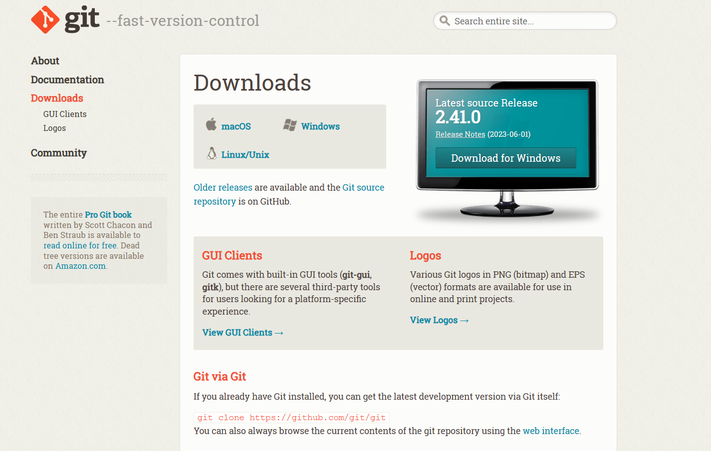
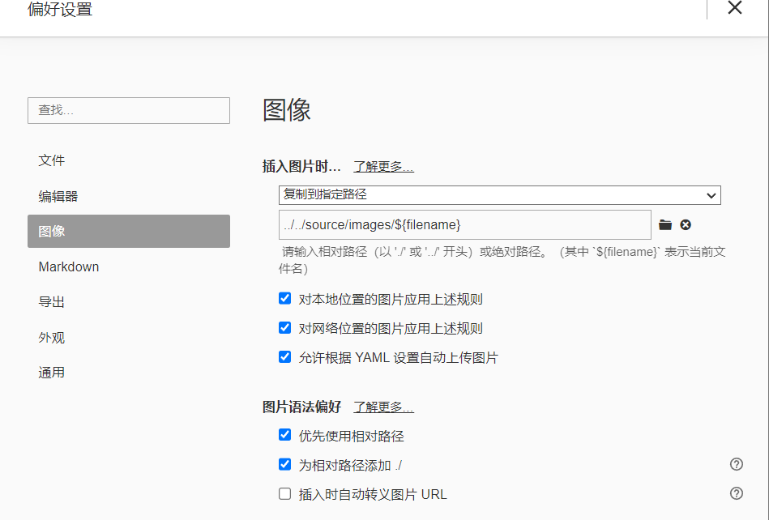
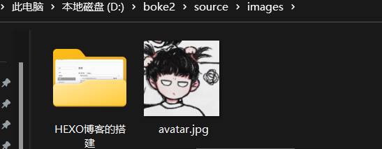
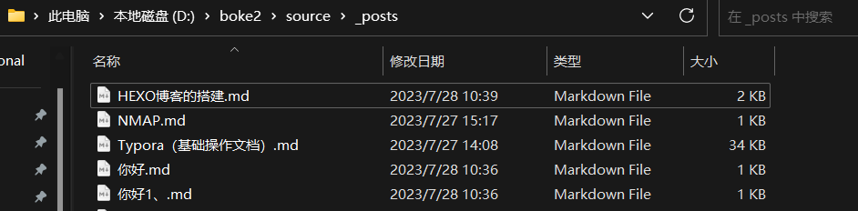
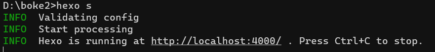

## 下载node.js和git


### 安装（node.js）

[**node.js下载链接**](https://nodejs.org/en) 左边那个


**[Node.js安装教程及环境配置](https://blog.csdn.net/WHF__/article/details/129362462)**


### 安装git

[**git下载链接**](https://git-scm.com/downloads) 选择合适的版本下载



**[git的安装与环境配置](https://zhuanlan.zhihu.com/p/597447255)**

## 安装hexo

> 打开cmd，执行 `npm install hexo -g`


## 克隆模板

> `git clone https://github.com/theme-keep/hexo-theme-keep-starter <自己的博客名>`


## 进入文件夹安装依赖

> ```cmd
> cd <博客的文件夹>
> npm config set registry https://registry.npm.taobao.org/    (如果下载太慢则可以用淘宝源下载)
> npm install
> ```


## 安装工具Typora

>安装 Typora，插入图片比较方便
>
>打开 **Typora**，点击“**文件**”，进入“**偏好设置**”，点击“**图像**”，配置如图所示：
>
>选则“**复制到指定路径**”
>
>下方填写“**../../source/images/${filename}**”
>
>
>
>进入自己博客的文件夹的**source**目录，新建一个文件夹**images**，以后所有博客的文章的图片都将自动部署到这边
>
>


## 新建文章

>进入博客的文件夹打开**cmd**
>
>执行 `hexo new <文章名>`
>
>或者 `hexo new post <文章名>`
>
>
>
>然后到博客的**source**目录下的**_posts**目录下就有相应的 **.md** 文件
>
>
>
>即可编辑文件
>
>编辑文件用的是Typora，使用的是**markdown**语言，如果不太会编写可查看本博客另一篇文章（[**markdown的使用说明**](https://cjcniubi666.github.io/2023/07/27/Typora%EF%BC%88%E5%9F%BA%E7%A1%80%E6%93%8D%E4%BD%9C%E6%96%87%E6%A1%A3%EF%BC%89/)）


## 本地部署

>打开**cmd**，进入博客目录，使用命令 `hexo server` 可缩写 `hexo s`
>
>
>
>浏览器输入地址 http://localhost:4000/即可本地预览部署的博客情况


## 部署博客到GitHub上

>先创建一个GitHub账户


### 新建repo

>名字取： `<个性名>.github.io`，例如 `CJCniubi666.github.io`
>
>新建好后有一个 SSH repo ：`git@github.com:<GitHub用户名>/<个性名>.github.io.git` ，此处后面会用到


### 配置GIT SSH key

>进入到 **.ssh** 文件夹
>
>
>
>用写字板打开**id_rsa.pub**
>
>
>
>复制里面所有的信息


>然后登录到**GIThub**
>
>点击**Settings**
>
>在点击**SSH and GPG keys**
>
>点击**NEW SSH key**
>
>名字随便取一个
>
>把刚刚复制的内容粘贴到Key下
>
>
>
>然后点击 **添加 SSH 密钥** 完成即可


### 安装快速部署插件

>打开cmd，执行 `npm install hexo-deployer-git --save`


### 配置部署信息

>进入博客文件夹，打开 **_config,yml**,在最后一行输入
>
>
>
>中间的 repo 的内容填上方说过的`git@github.com:<GitHub用户名>/<个性名>.github.io.git` 


### 正式部署

>进入博客文件夹，打开**cmd**
>
>清理缓存文件：`hexo clean`
>
>生成编译文件： `hexo g`
>
>发布博客： `hexo deploy` （或者缩写 `hexo d` ）
>
>执行完成后等待1，2分钟
>
>即可访问  **<个性名>.github.io** 进入你的博客了


# 注意

>本文使用的是keep的主题模板，如果使用本模板想美化自己的博客，可参考[**keep官方文档**](https://keep-docs.xpoet.cn/tutorial/get-start/quick-starter.html)


