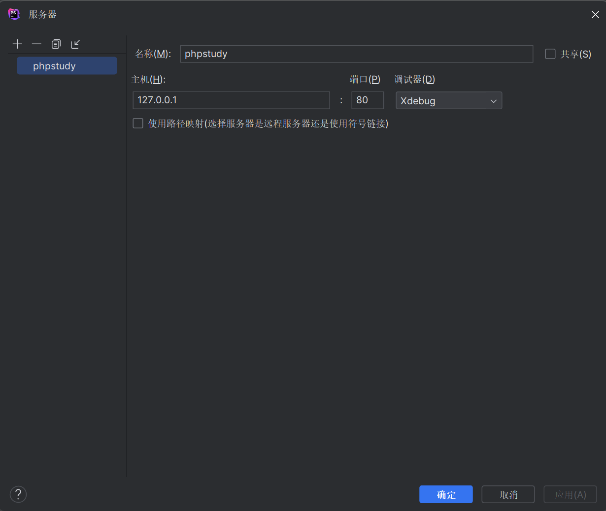
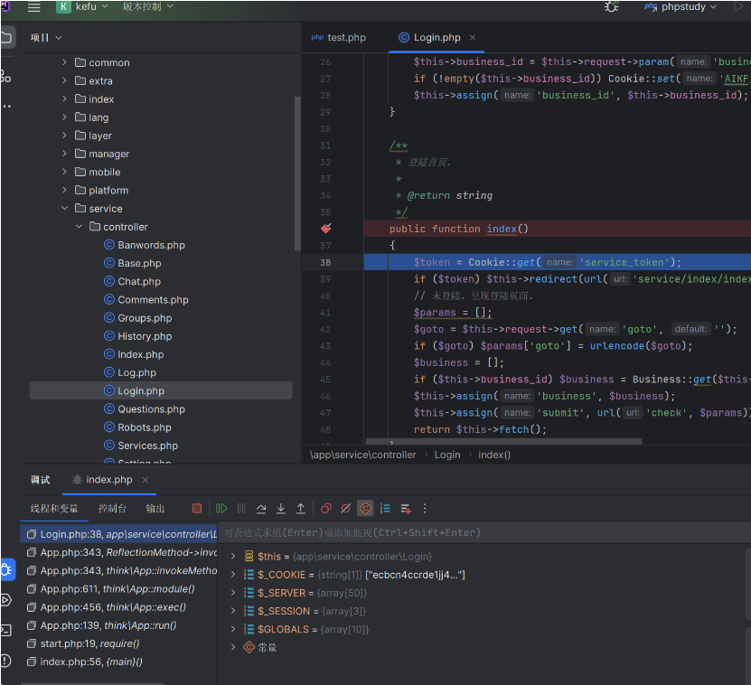

## 步骤

1. 添加服务器（本地）



2. 添加调试配置


3. 配置PHP环境


4. 启用`xdebug`扩展并添加以下内容至`php.ini`

```
xdebug.remote_enable=Onxdebug.remote_host=localhostxdebug.remote_port=9000xdebug.remote_handler=dbgpxdebug.idekey="phpstudy"xdebug.remote_autostart=On
```

5. 开始调试



## 解决调试超时
`php.ini`中的`xdebug`部分：

```
xdebug.remote_cookie_expire_time = 3600max_execution_time=3600max_input_time=3600default_socket_timeout = 3600
```

`Aapache`中`httpd.conf`

```
Timeout 3600FcgidIOTimeout 3600FcgidIdleTimeout 3600IPCConnectTimeout 3600IPCCommTimeout 3600
```