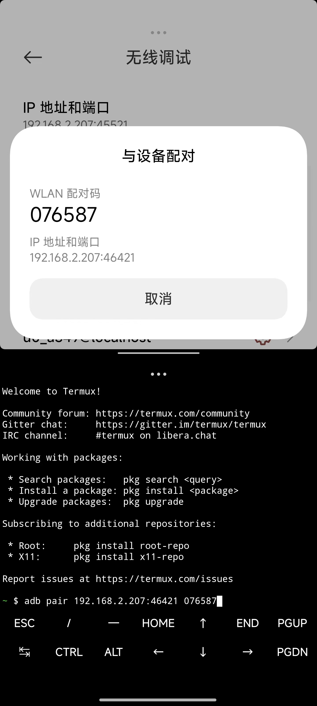
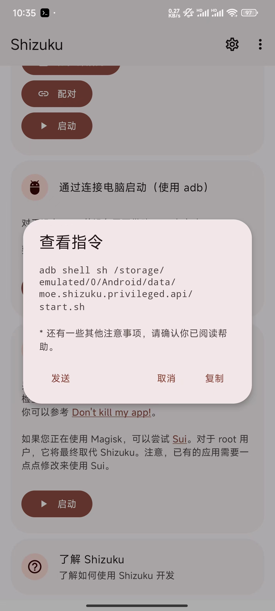

# adb调试Shizuku获取应用最高权限


- 首先去设置打开无线调试

- 然后点击`使用配对码配对设备`，在打开`Termux`，命令行要与`无线调试`同一界面，否则会有问题




- 输入命令
```
adb pair 192.168.2.207:46421 076587
adb connect 192.168.2.207:45521
```

- 打开`Shizuku`，点击`通过连接电脑启动`复制指令，粘贴至`Termux`




- 然后就可以了，就可以在`Shizuku`授权应用了

