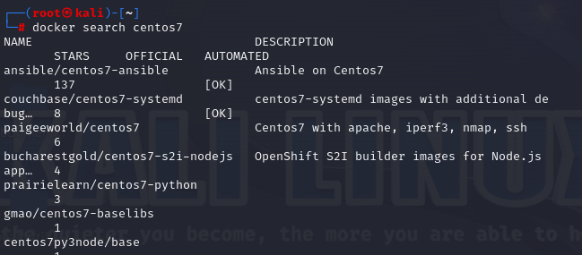

# 下载docker

```
apt-get install docker-ce docker-ce-cli containerd.io
```


[Docker 容器使用 | 菜鸟教程 (runoob.com)](https://www.runoob.com/docker/docker-container-usage.html)
# docker常见命令

> - 查看docker状态：`docker ps -a`
> - docker搜索镜像：`docker search centos7`
>  
> - 选择一个镜像拉取下来：`docker pull ansible/centos7-ansible`
> - 查看镜像列表：`docker images`
> - 启动对应的镜像： `docker run -it --name centos7_1 -p 80:80 ansible/centos7-ansible`
> - 进入对应的镜像：`docker exec -it centos7_1 /bin/bash`
> - 停止对应的镜像：`docker stop centos7_1`
> - 运行对应的镜像：`docker start centos7_1`
> - 删除对应的镜像：`docker rmi centos7_1` 
> - 新建一个dockerfile文件：`vim dockerfile`
>  
> - 自己构建镜像：`docker build -t hello .`
> - 运行并删除自己构建的镜像：`docker run --rm hello`
> 
>
> 
