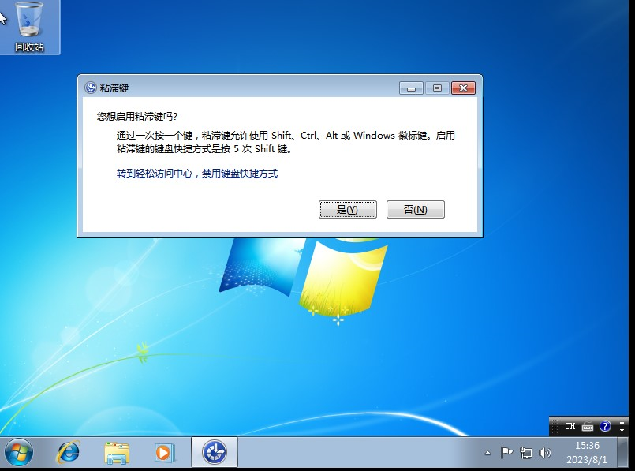
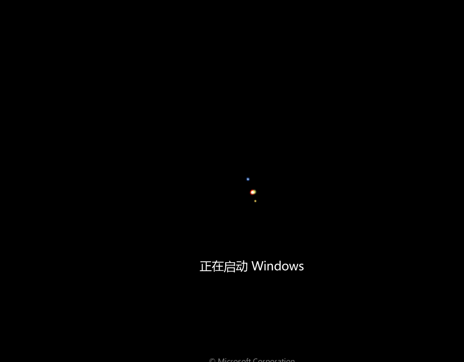
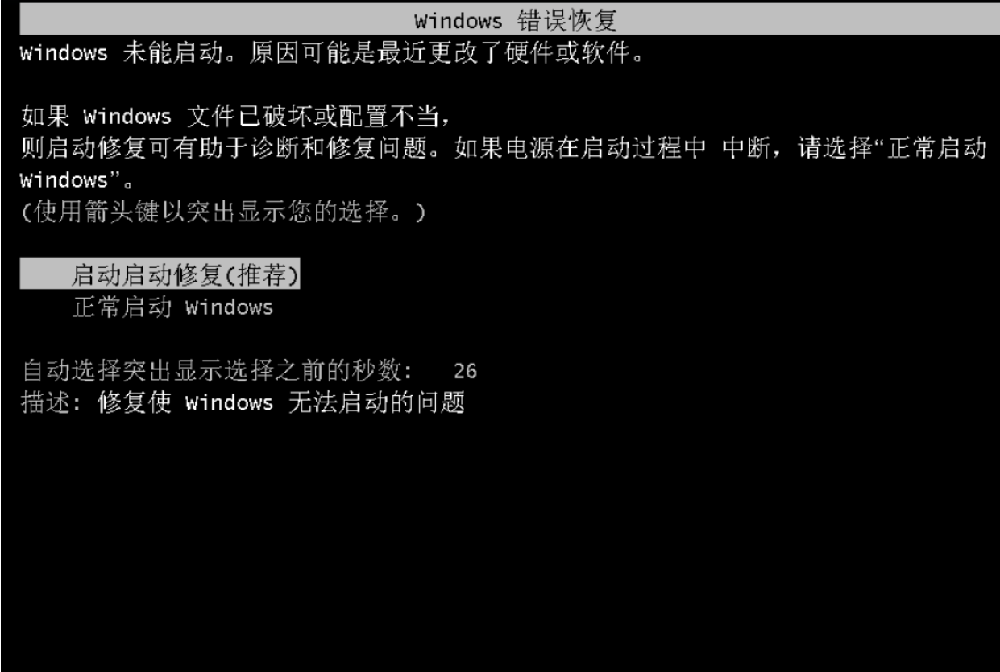
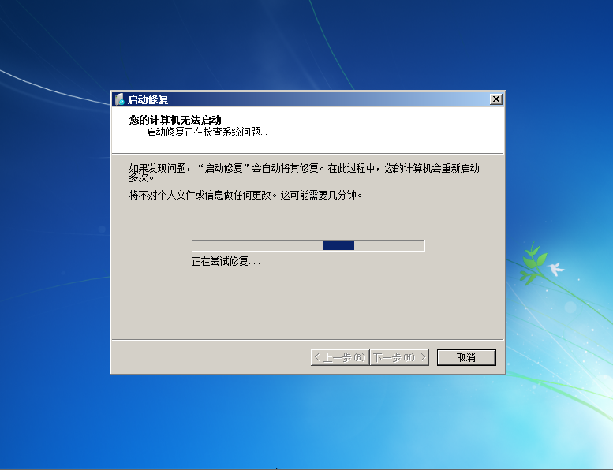
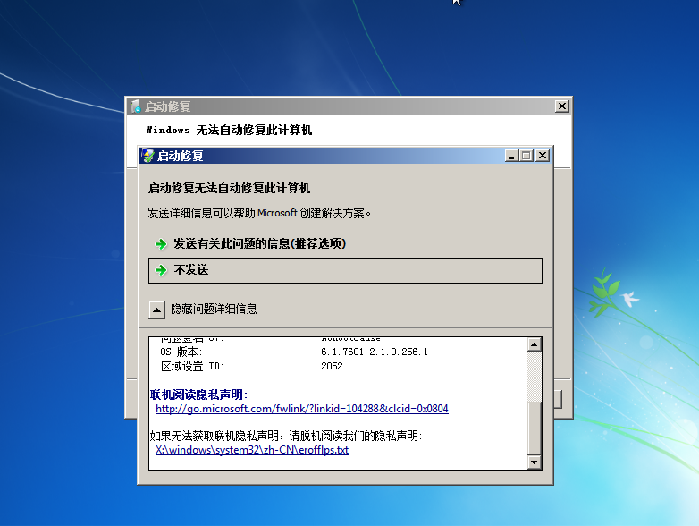
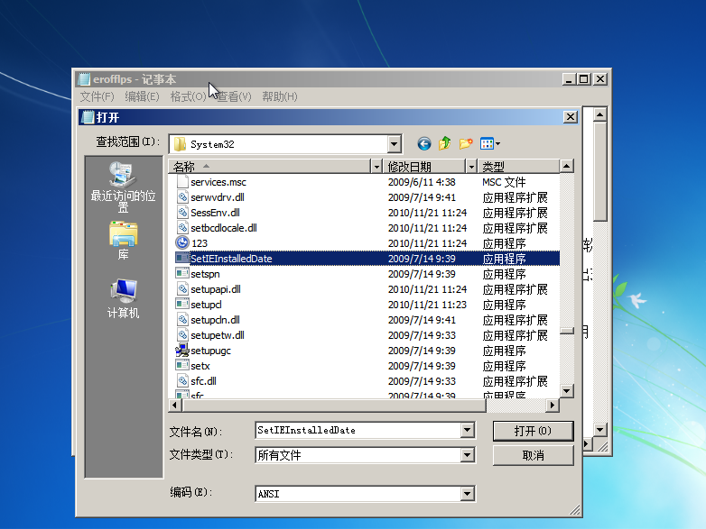
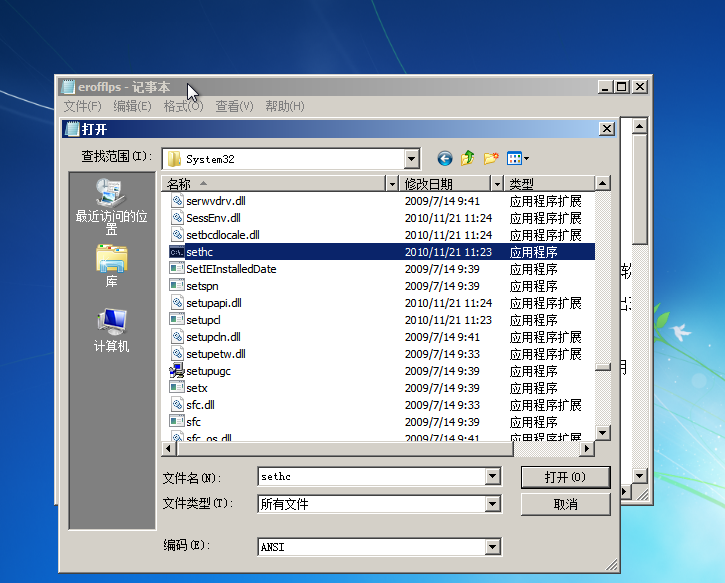
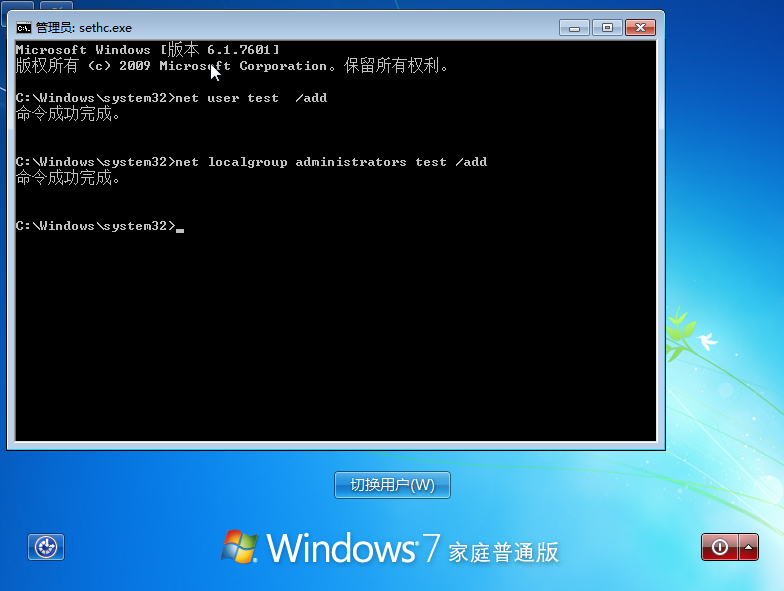
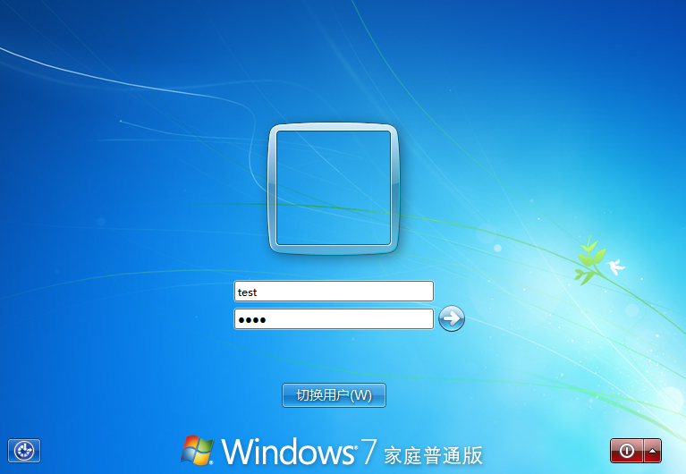

## 原理

> 利用连按5下`Shift`触发**粘滞键**漏洞破解`win7`开机密码。将`c:windows/system32/sethc.exe`替换为`cmd.exe`文件，达到新增用户、修改账号密码的目的。


## 准备

> 实验主机：win7，windowsxp，Windows 2003 都可以进行（无杀软）


## 漏洞复现

> 本文用的是**win7**系统进行**复现**

### 首先测试是否存在粘滞键

>在正常登录的**win7**桌面连按5次**shift**键，看是否有**粘滞键提示**弹出
>
>
>
>如果有弹出，则表示可能存在其漏洞，然后将电脑关机

### 进入启动启动修复模式

> 电脑关机后，在开机准备启动
>
> 然后看到了这个**正在启动windows**，马上**强制关机！！**
>
> 
>
> 关机之后，在启动电脑
>
> 这样会让系统觉得自己可能是因为硬件或者软件问题，将进入**Windows错误恢复模式**
>
> 
>
> 在选择**启动启动修复（推荐）**

###  替换sethc.exe为cmd

> 在等待加载之后，会弹出**启动修复模式**，耐心**等待**1~2分钟
>
> 
>
> 随之这个程序会**无法自动修复此计算机**，随之会弹出以下画面
>
> 
>
> 点击查看问题详细信息，并滑动到最下面的 
>
> **如果无法获取联机隐私声明，请脱机阅读我们的隐私声明下面的链接**
>
> 
>
> 打开之后，点击**文件**中的**打开**
>
> 
>
> 找到路径：`计算机`->`c盘`->`Windows`->`system32`
>
> 点击文件类型中的**所有文件**
>
> 
>
> 找到`sethc.exe`文件，并把它随便改一个名字
>
> 
>
> 再找到**cmd**，把cmd**复制**一个，再**粘贴**至此目录
>
> 
>
> 把这个**cmd副本**的改名为**sethc**
>
> 
>
> 最后改完后再正常重新启动
>
> 正常开机后，**摁5次shift**，会看到弹出了**cmd**界面
>
> 
>
> 然后就可以创建一个新的用户，命令：`net user test <密码> /add`
>
> 然后把该用户加入管理员组，命令：`net localgroup administrators test /add`
>
> 
>
> 然后就可以用刚刚创建的用户登入系统了
>
> 


## 拓展

> ```拓展
> 屏幕键盘：C:\Windows\System32\osk.exe 
> 放大镜：C:\Windows\System32\Magnify.exe 
> 旁白：C:\Windows\System32\Narrator.exe 
> 显示切换器 C:\Windows\System32\DisplaySwitch.exe 
> 应用切换器：C:\Windows\System32\AtBroker.exe
> ```
>
> 这些也可以使用类似方法进入系统取得**权限**


