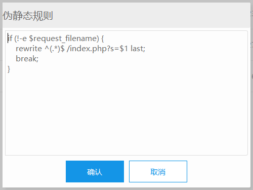

# thinkphp-nginx伪静态配置

点击`伪静态`后输入如下代码,并重启Nginx。  
代码如下：

```php
if (!-e $request_filename) {
    rewrite ^(.*)$ /index.php?s=$1 last;
    break;
}
```

nginx中的配置会变为：

```nginx
#nginx配置
location / {
    index  index.html index.htm index.php l.php;
    autoindex  on;
    if (!-e $request_filename) {
        rewrite ^(.*)$ /index.php?s=$1 last;
        break;
    }

}
```



# thinkphp-apache伪静态

1、httpd.conf 配置文件中需加载 mod_rewrite.so 模块；

2、AllowOverride None 将 None 改为 All；

3、把下面的内容保存为 .htaccess 文件放到应用入口文件的同级目录下；

```php
<IfModule mod_rewrite.c>
Options +FollowSymlinks -Multiviews
RewriteEngine on

RewriteCond %{REQUEST_FILENAME} !-d
RewriteCond %{REQUEST_FILENAME} !-f
RewriteRule ^(.*)$ index.php?/$1 [QSA,PT,L]
</IfModule>
```

# thinkphp-ISS伪静态

如果你的服务器环境支持ISAPI_Rewrite的话，可以配置httpd.ini文件，添加下面的内容：

```html
RewriteRule (.*)$ /index\.php\?s=$1 [I]
```

在IIS的高版本下面可以配置web.Config，在中间添加rewrite节点：
```
<rewrite>
 <rules>
 <rule name="OrgPage" stopProcessing="true">
 <match url="^(.*)$" />
 <conditions logicalGrouping="MatchAll">
 <add input="{HTTP_HOST}" pattern="^(.*)$" />
 <add input="{REQUEST_FILENAME}" matchType="IsFile" negate="true" />
 <add input="{REQUEST_FILENAME}" matchType="IsDirectory" negate="true" />
 </conditions>
 <action type="Rewrite" url="index.php/{R:1}" />
 </rule>
 </rules>
 </rewrite>

```
