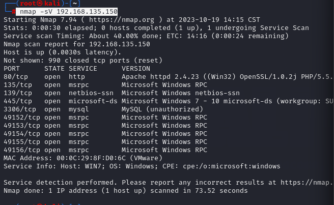
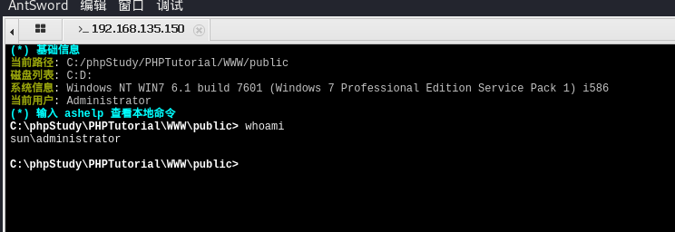
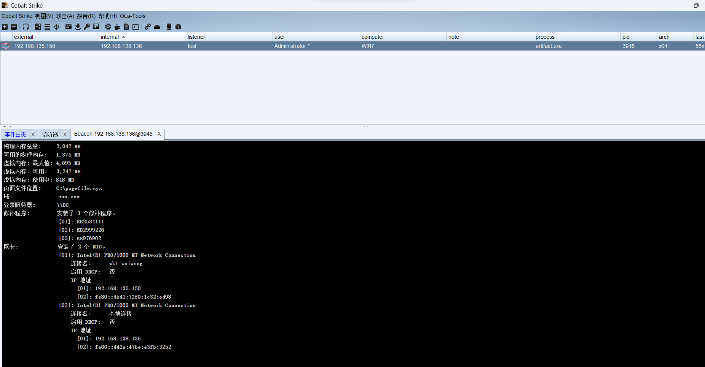
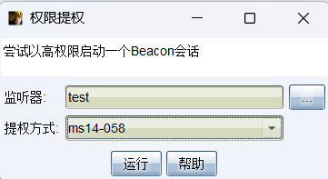
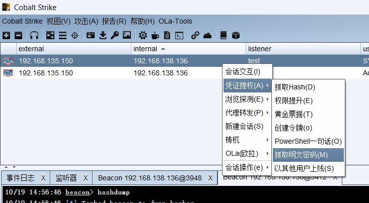
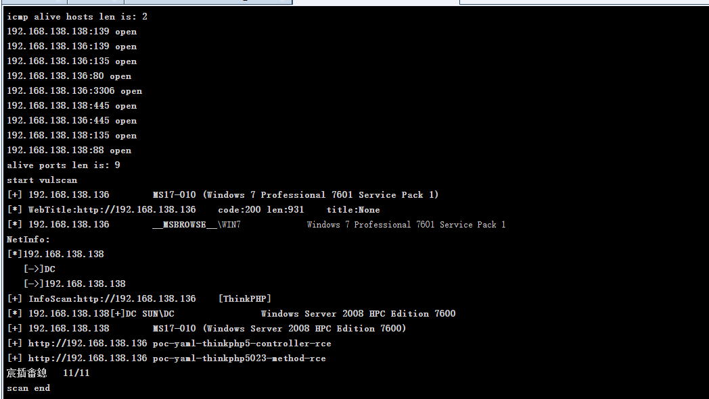

# 靶场搭建

## 靶场下载
地址:[漏洞详情 (qiyuanxuetang.net)](http://vulnstack.qiyuanxuetang.net/vuln/detail/7/)

作者阿里云盘也有

总共有俩台主机 DC（win2008）,win7

win7有俩张网卡，模拟内外网


主机密码

win7

sun\heart 123.com

sun\Administrator dc123.com


DC2008

sun\admin 2020.com


## 网络配置

把攻击机（kali）网段可临时改为同网段IP

```
ifconfig eth0 192.168.135.128
```

然后试试win7能不能ping通kali

试试win7能不能ping通2008


## 环境配置

打开win7和2008

win7关闭防火墙，打开phpstudy


靶场搭建完成


# 外网渗透测试


```
arp -l -I eth0

nmap -sV 192.168.135.150
```



发现打开许多端口，先尝试访问http的服务


发现是ThinkPHP V5.0的

因为thinkphp曾曝过许多漏洞，在网上查找利用工具


利用工具下载地址[Lotus6/ThinkphpGUI at 1.3 (github.com)](https://github.com/Lotus6/ThinkphpGUI/tree/1.3)

在kali运行该程序

```
java -jar ThinkphpGUI-1.3-SNAPSHOT.jar 
```


尝试版本之后，发现5.0.22/5.1.29的可以运用，并已经把上传的地址，和马的地址给我们了，尝试蚁剑连接


进入虚拟终端，查看用户已经为管理员用户了



上传cs的木马进行下一步操作

启动cs，生成Windows可执行文件，用蚁剑上传，在通过虚拟终端运行上传的可执行文件

再看cs客户端发现已上线，调整睡眠时间为0

查看系统信息，systeminfo



然后再网上查看是否有系统漏洞

去这个网站[潮影在线免杀平台 (tidesec.com)](http://bypass.tidesec.com/exp/)

然后把复制的系统信息粘贴上去


发现可尝试多种漏洞，用cs自带的提权漏洞



发现可以直接提升为system权限

然后抓取hash，和明文密码



进行网络探测

```
net view
```


发现还有一台192.168.138.138的主机，上传fscan并运行，查看dc的开放端口



发现可以用ms17-010漏洞进行通杀

同时也发现开放了445端口

先创建一个smb的监听器

然后再目标列表中找到192.168.138.138进行横向移动


发现连接成功


成功拿下域控主机
