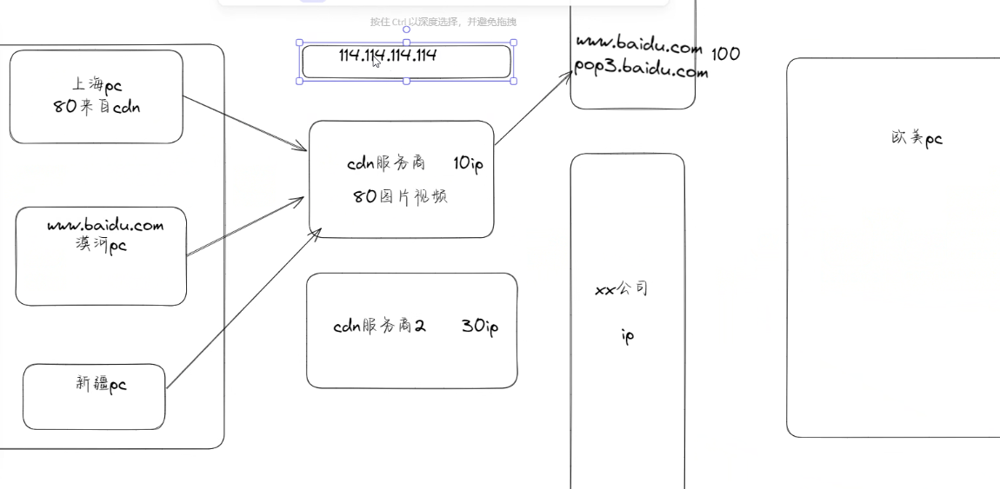
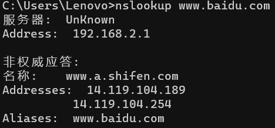
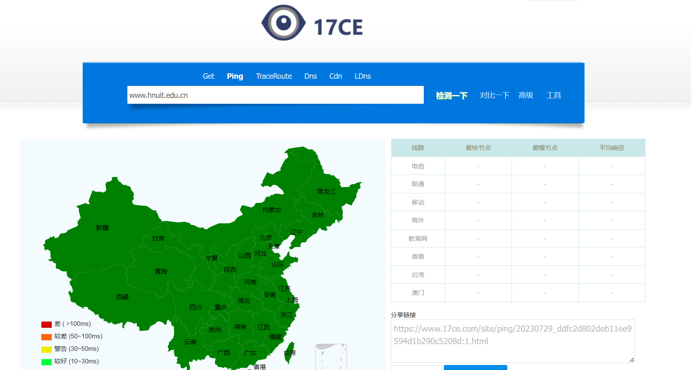
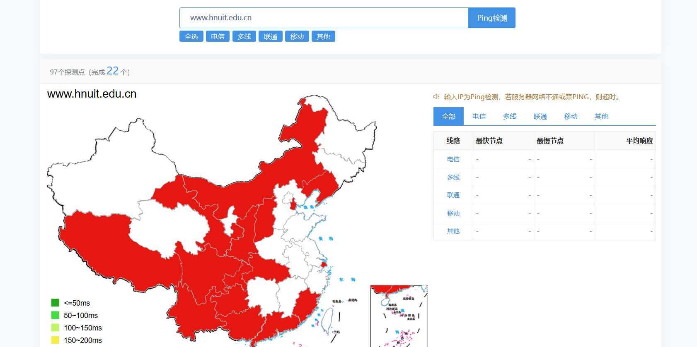
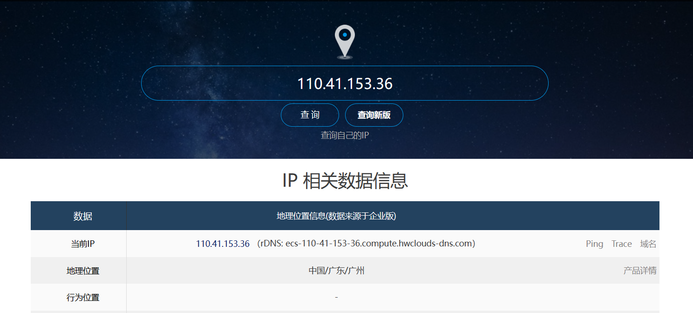
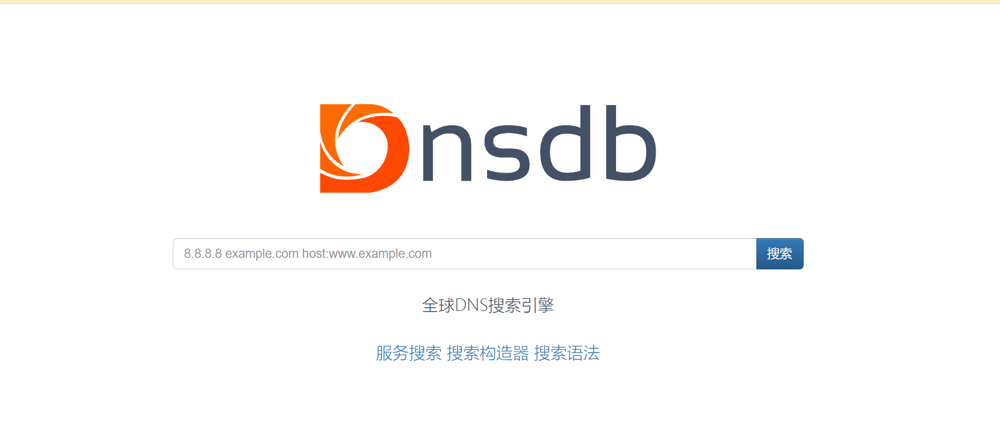
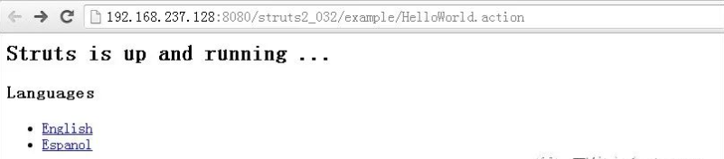
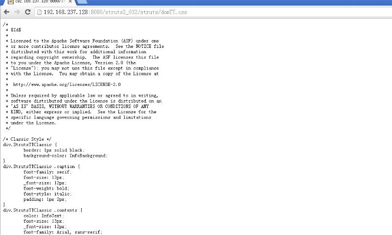

## 域名信息

可用搜索引擎直接搜索，或者运用[企查查](https://www.qcc.com/)，[爱企查](https://aiqicha.baidu.com/)，[ICP备案网](https://icp.chinaz.com/)


##  Whois

> [Whois](https://www.whois.com/) 可以查询域名是否被注册，以及注册域名的详细信息的数据库，其中可能会存在一些有用的信息，例如域名所有人、域名注册商、邮箱等。
>
> [站长工具（whois）](https://whois.chinaz.com/)
>
> [腾讯whois](https://whois.cloud.tencent.com/)


## 搜索引擎搜索（语法）

> | 指令            | 用法                                                         | 示例                                                         |
> | --------------- | ------------------------------------------------------------ | ------------------------------------------------------------ |
> | ""(引号)        | 用引号来查询一个确切的单词或短语                             | 查找有关《百年孤独》这本书的网页，语法："百年孤独"           |
> | OR(或者)        | 用OR分隔搜索词，同时执行两个搜索查询，这将找到包含多个单词之一的页面。 | 搜索引用了“Google Drive”、“Dropbox”或“OneDrive”的页面，语法：Google Drive OR Dropbox OR OneDrive |
> | -(减号、连字符) | 在单词或网站前使用连字符将其从搜索结果中排除                 | 从搜索结果中排除维基百科页面，语法：- site:[http://wikipedia.org](https://link.zhihu.com/?target=http%3A//wikipedia.org) |
> | allintext:      | 使用allintext:[搜索短语]查找正文中包含这些单词的页面         | 查找正文中有关Roth、IRA投资讯息的页面，语法：allintext:Roth IRA 投资 |
> | allintitle:     | 使用allintitle:[搜索短语]查找标题中包含这些单词的页面        | 查找标题中同时包含“Apple”和“notebook”的页面，语法：allintitle:Apple notebook |
> | allinurl:       | 使用allinurl:[搜索短语]查找URL中包含这些单词的页面           | 查找URL中同时包含”Microsoft” and “Surface”的页面，语法：allinurl:Microsoft Surface |
> | site:           | 使用site:[URL]将搜索结果限制到特定网站                       | 查找云点SEO网关于谷歌SEO的页面，语法：site:[http://yundianseo.com](https://link.zhihu.com/?target=http%3A//yundianseo.com) 谷歌SEO |
> | ~(波浪号)       | 使用波浪号获得目标关键词及其近似词的搜索结果                 | 查找SEO方面的策略或者教程，语法：SEO ~教程                   |
> | related:        | 使用related:[URL]查找与特定网站类似的网站                    | 查找与云点SEO类似的网站，语法：related:[http://yundianseo.com](https://link.zhihu.com/?target=http%3A//yundianseo.com) |
> | define:         | 使用define:[搜索短语]查找其定义                              | 查找SEO的定义，语法：define:SEO                              |
> | $               | 使用$查找特定价格的商品                                      | 查找一款售价在99美金的手机，语法：mobile phone $99           |
> | location:       | 使用location:[地点]查看某个地区内的相关信息                  | 查询南京的酒店，语法：hotel location:Nanjing                 |
> | *（星号）       | 添加星号作为未知单词或事实的占位符                           | 查找以“生活就像一个”开头的引语，语法：生活就像一个*          |
> | filetype:       | 使用filetype:[后缀]将结果限制为特定的文件格式，如PDF或DOC。  | 查找PDF格式的Microsoft Office键盘快捷键相关文件，语法：filetype:pdf Microsoft Office键盘快捷键 |
> | ..（两点）      | 用两个句点分隔数字，不带空格，以搜索该范围内的数字           | 查找1950年至2000年间发生的计算机里程碑，语法：”计算机里程碑” 1950..2000 |
> | AROUND(n)       | 在两个搜索词之间加上AROUND(n)，以查找两个词间有特定距离的页面。用数字n设置术语之间的最大距离，这对于查找两个搜索词之间的关系很有用。 | 查找在同一句话或段落中提到Facebook和Microsoft的页面，语法：Facebook AROUND(7) Microsoft |


## 子域名查询

> 子域名查询有许多方法，例如在线的有
>
> - [DNSDumpster](https://dnsdumpster.com/)
> - [zoomeye](https://www.zoomeye.org/discover)
> - [fofa](https://fofa.info/)
>
> 本地的
>
> - OneFoAll
> - 子域名挖掘机


## CDN

###  CDN概念

> CDN的全称是Content Delivery Network，即内容分发网络。其基本思路是尽可能避开互联网上有可能影响数据传输速度和稳定性的瓶颈和环节，使内容传输得更快、更稳定。通过在网络各处放置节点服务器所构成的在现有的互联网基础之上的一层智能虚拟网络，CDN系统能够实时地根据网络流量和各节点的连接、负载状况以及到用户的距离和响应时间等综合信息将用户的请求重新导向离用户最近的服务节点上。其目的是使用户可就近取得所需内容，解决 Internet网络拥挤的状况，提高用户访问网站的响应速度。
>
> 

### 传统访问

> 用户访问域名–>解析服务器 IP–>访问目标主机

### 普通的CDN访问

> 用户访问域名–>CDN 节点–>真实服务器 IP–>访问目标主机

### 绕过CDN(判断IP是否为网站真是IP)

#### Nslookup（判断）

> Win下使用**nslookup**命令进行查询，若返回域名解析结果为多个ip，多半使用了CDN，是不真实的ip
>
> 

####  多地ping查询（判断）

> 使用不同区域ping，查看ping的ip结果是否唯一。若不唯一，则目标网站可能存在CDN
>
> 查询网站：
>
> https://www.17ce.com/
>
> 
>
> 
>
> https://ping.chinaz.com/
>
> 


####  使用工具直接查询

>  查询网站：https://www.ipip.net/ip.html
>
>  
>
>  [微步在线](https://x.threatbook.com/v5/mapping)
>
>  
>
>  [Dnsdb](https://www.dnsdb.io/zh-cn/)
>
>  
>
>  [CDN查询IP](https://tools.ipip.net/cdn.php)
>
>  
>
>  [SecurityTrails](https://securitytrails.com/)平台
>
>  


## IP查询

> 在线可用[IP反查域名](https://www.dnsgrep.cn/ip)，[DNS反向解析记录](https://www.dynu.com/zh-CN/NetworkTools/ReverseLookup)
>
> [fofa](https://fofa.info/)等空间引擎搜索


> 端口扫描：
>
> NMAP
>
> 御剑端口扫描


## 可运用的网络空间搜索引擎

> - [FOFA](https://fofa.info/)
> - [ZOOMeye](https://www.zoomeye.org/discover)
> - [360quake](https://quake.360.net/quake/#/index)
> - [shodan](https://www.shodan.io/)
> - [鹰图](https://hunter.qianxin.com/)


## 指纹识别

查看网页特殊的信息

### 开发框架

目前Java站点主流框架就是**Struts2**，**Spring**框架，以下几个方法用来区分是什么框架


#### URL中添加不存在的路径

在URL的反斜杠部分添加网站**不存在的路径**，最好是随机字符串组成的较长路径，

如果返回**同样的页面**，则大概率是**Struts2**框架，

如果**返回404**或者是**报错**，则大概率是**Spring**框架。

##### 第1步：

在最后右边反斜杠处添加一个不存在的路径**/xxxxxxxxxx/**，如下所示：

```
http ://127.0.0.1:9999/S2_016_war/barspace**/xxxxxxxxx/**login.do 
返回与原URL相同页面，则是**Struts2**框架

http ://127.0.0.1:9999/S2_016_war/barspace**/xxxxxxxxx/**login.do 
返回与原URL异同页面，则是**Spring**框架
```


##### 第2步：

如果两个URL均报错、或者均正常，无法区分，那么继续在前一个反斜杠处添加一个不存在的路径，如下所示：

```
http ://127.0.0.1:9999/S2_016_war**/xxxxxxxxx/**barspace/login.do 
返回与原URL相同页面，则是**Struts2**框架

http ://127.0.0.1:9999/S2_016_war**/xxxxxxxxx/**barspace/login.do 
返回与原URL异同页面，则是**Spring**框架
```


##### 第3步：

如果还是没法区分，继续在前一个反斜杠处添加一个不存在的路径，如下所示：

```
http ://127.0.0.1:9999**/xxxxxxxxx/**S2_016_war/barspace/login.do 
返回与原URL相同页面，则是**Struts2**框架

http ://127.0.0.1:9999**/xxxxxxxxx/**S2_016_war/barspace/login.do 
返回与原URL异同页面，则是**Spring**框架
```

按照前面的步骤，依次添加不存在的路径，直到URL根目录为止。


#### URL添加/struts/domTT.css

在URL的Web应用根目录下添加/struts/domTT.css，如果返回css代码，那么99%是Struts2。

注：这个domTT.css文件在网站源码文件中是找不到的，用磁盘搜索的方式搜索不到的，那为什么能访问到呢，因为这个文件在Struts2的jar包中。

原理：凡是以/struts开头的URL，Struts2的过滤器都会到struts2-core-2.0.x.jar：/org/apache/struts2/static/下面去找资源，然后读取此文件内容。

举例如下：

http ://192.168.237.128:8080/struts2_032/example/HelloWorld.action



在网站根目录下添加/struts/domTT.css后访问，返回css代码。

http ://192.168.237.128:8080/struts2_032/struts/domTT.css



#### 3看网站图标

如果网站图标是一片小绿叶的图标，则基本上就是**Spring**的框架，**Struts2**框架没有常用图标


#### 404，500响应码返回信息

输入一个不存在的路径，返回404页面，或者传入一些乱码字符，造成当前页面500响应码报错，抛出异常信息。

**Struts2**常用的关键字有这些：例如**no action mapped**、**struts2**、**namespace**、**defined for action**等。

**Spring**的报错信息如下：含有**Whitelabel Error Page** 关键字


###  指纹收录平台

- [360Finger-P](https://fp.shuziguanxing.com/#/)

- [潮汐指纹](http://finger.tidesec.net/)

-  [云悉指纹](https://www.yunsee.cn/)


##  敏感目录扫描

- 御剑后台扫描
- dirseach(kali)
- 小米范WEB目录扫描器


## 敏感信息泄露

- 可以利用谷歌语法搜索相关敏感信息
- 查看源代码等相关敏感信息
- 可通过抓包修改某些值得到敏感信息
- 可以通过得知对方邮箱进行钓鱼操作
- telegram社工库搜索
- 公司公众号，企业号，员工网盘，github等地方可能存在敏感信息
