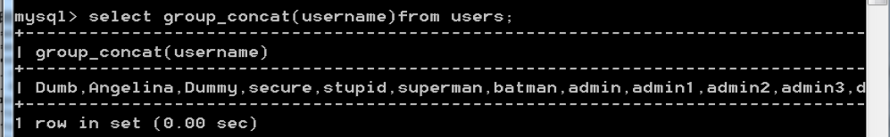
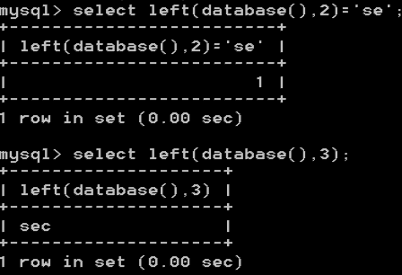
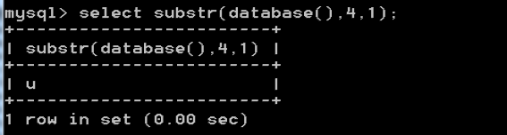
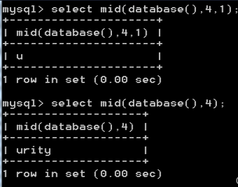

## 前言

| 数据库         | 存储数据的仓库，数据是有组织的进行存储                       | DataBase (DB)                      |
| -------------- | ------------------------------------------------------------ | ---------------------------------- |
| 数据库管理系统 | 操纵和管理数据库的大型软件                                   | DataBase Management System ( DBMS) |
| SQL            | 操作关系型数据库的编程语言，定义了一套操作关系型数据库统一标准 | structured Query Language (sQL)    |


## 什么是数据库

> 数据库（database）是用来**组织**、**存储**和**管理数据**的**仓库**。
> 
> 当今世界是一个充满着数据的互联网世界，充斥着大量的数据。数据的来源有很多，比如出行记录、消费记录、浏览的网页、发送的消息等等。除了文本类型的数据，图像、音乐、声音都是数据。
> 
> 为了方便管理互联网世界中的数据，就有了**数据库管理系统**的概念（简称：数据库）。用户可以对数据库中的数据进行新增、查询、更新、删除等操作。


## 数据库的分类


###  关系型数据库（传统型数据库 或 SQL数据库）

> MySQL、Oracle、SQL Server 属于**传统型数据库**（又叫做：关系型数据库 或 SQL 数据库），这三者的设计理念相同，用法比较类似。
> 
> 1、MySql数据库，默认端口是:3306;
> 
> 2、Oracle数据库，默认端口号为: 1521;
> 
> 3、Sql Server数据库，默认端口号为:1433;
> 
> 4、DB2数据库，默认端口号为:5000;
> 
> 5、PostgreSQL数据库，默认端口号为:5432;
> 
> 6、国产的DM达梦数据库，默认端口号为:5236。


###  非关系型数据库（新型数据库 或 NoSQL数据库）

> Nosql 数据库有 redis ， memcache ， MongoDb等等。
> 
> 1.Redis数据库，默认端口号:6379;
> 
> 2.Memcached数据库，默认端口号:11211 ;
> 
> 3.MongoDB数据库，默认端口号:27017;


## 常见的数据库


### MySQL   3306

> MySQL是一个关系型数据库管理系统，由瑞典MySQL AB公司开发，属于Oracle旗下产品。
> 
> MySQL是最流行的关系型数据库管理系统之一，在 WEB应用方面，MySQL是最好的 RDBMS > （RelationalDatabase Management System，关系数据库管理系统）应用软件之一。
> 
> MySQL是一种关系型数据库管理系统，关系数据库将数据保存在不同的表中，而不是将所有数据放在一个大仓库内，这样就增加了速度并提高了灵活性。
> 
> MySQL5.0增加了inforation_schema系统数据库MySQL 。
> 
> （可以通过查看是否有该表判断数据库版本是否大于5.0）


###  SQL Server    1433

> SQL Server是Microsoft公司推出的关系型数据库管理系统。
> 
> 具有使用方便可伸缩性好与相关软件集成程度高等优点，可跨越从运行Micrcsoft Windows 98的膝上型电脑到运行Microsoft  
> 
> Windows 2012的大型多处理器的服务器等多种平台使用。Microsoft SQL Server是一个全面的数据库平台，使用集成的商业智能(BI)工具提供了企业级的数据管理。
> 
> Microsoft SQLServer数据库引擎为关系型数据和结构化数据提供了更安全可靠的存储功能，使您可以构建和管理用于业务的高可用和高性能的数据应用程序。


###  Oracle   1521

> Oracle是在数据库领域一直处于领先地位的产品。可以说Oracle数据库系统是世界上流行的关系数据库管理系统，系统可移植性好、使用方便、功能强，适用于各类大、中、小微机环境。它是一种高效率的、可靠性好的、适应高吞吐量的数据库方案。
> 
> - 可用性强
> - 可扩展性强
> - 数据安全性
> - 强稳定性强


## 数据库基础命令


### 进入数据库

> `mysql -h 127.0.0.1 -u root -p;`
> 
> 接着输入密码


### 创建数据库

> `create database database_name;`


### 展示数据库

> `show databases;`


### 选择数据库

> `use 数据库名;`


### 展示表内容

> `show tables;`


### 创建表

```sql
CREATE TABLE school (
    id INT AUTO_INCREMENT PRIMARY KEY,
    student_name VARCHAR(50) NOT NULL,
    email VARCHAR(100) UNIQUE,
    age INT
);
```

> - `id` 是主键，使用 `INT` 数据类型，并使用 `AUTO_INCREMENT` 关键字使其自动增长，确保每条记录都有唯一的标识符，`PRIMARY KEY`表示主键。
> 
> - `username` 是一个 `VARCHAR(50)` 类型的列，`NOT NULL` 约束确保此列不为空。
> 
> - `email` 是一个 `VARCHAR(100)` 类型的列，并使用 `UNIQUE` 约束确保邮箱地址是唯一的。
> 
> - `age` 是一个 `INT` 类型的列，可以为空（即没有 `NOT NULL` 约束）。

  

### 插入数据语句

```sql
INSERT INTO table_name (id, username, email, age) 

values (1, 'john_doe', 'john@example.com', 30);
```


### 插入表属性

```sql
alter table table_name

add colume_name data_type [constraints];
```

> 其中，`table_name` 是目标表的名称，`column_name` 是要添加的新属性（列）的名称，`data_type` 是新属性的数据类型，`constraints` 是新属性的约束（可选）。


### 更新表属性的值

```sql
UPDATE table_name 

SET column_name = new_value 

WHERE condition;
```

> 其中，`table_name` 是目标表的名称，`column_name` 是要更新数据的列名，`new_value` 是要设置的新值，`condition` 是确定要更新哪些记录的条件。


### 展示表的属性

> `show columns from table_name;`  或者 `desc table_name;`


### 查询语句

> `select id,emali from table_name;`
> 
> 如果要查询所有，就输入`select * from table_name;`
> 
> 然后可以再后面接许多子句，例如：

 1. **SELECT 子句**：用于指定要返回的列，以及可以使用表达式进行计算和重命名列。
> 
>    ```sql
>    SELECT column1, column2, ...
>    FROM table_name;
>    ```

 2. **where 子句**：用于筛选满足指定条件的记录。可以使用比较运算符、逻辑运算符和通配符等来构建条件。
> 
>    ```sql
>    SELECT column1, column2, ...
>    FROM table_name
>    WHERE condition;
>          
>    例如：select * from table_name where class="一班";
>    ```

 3. **order by 子句**：用于按照指定的列对结果进行排序，可以选择**升序（ASC，默认）**或**降序（DESC）**排序。
> 
>    ```sql
>    SELECT column1, column2, ...
>    FROM table_name
>    ORDER BY column1 ASC;
>          
>    column1表示列名
>    例如：select * from table_name order by id asc;
>    ```

 4. **group by 子句**：用于将结果按照指定的列进行分组，并对每个组进行聚合操作，如计算 SUM、COUNT、AVG 等。
> 
>    ```sql
>    SELECT column1, SUM(column2)
>    FROM table_name
>    GROUP BY column1;
>          
>    column1表示列名
>    例如：select class,avg(age) from school group by class;
>    按照class班级进行分组，查询每个班的平均年纪
>    ```

 5. **having 子句**：用于对 GROUP BY 后的结果进行过滤，只返回满足特定条件的组。
> 
>    ```sql
>    SELECT column1, SUM(column2)
>    FROM table_name
>    GROUP BY column1
>    HAVING SUM(column2) > 100;
>          
>    select class,avg(age) from school group by class having avg(age)<50;
>    查询平均年龄50以下的每个班的平均年龄
>    ```

 6. **limit 子句**：用于限制查询结果的返回数量。
> 
>    ```sql
>    SELECT column1, column2, ...
>    FROM table_name
>    LIMIT 10;
>       
>    select * from school limit 1,5;
>    限制返回从第一条之后的5条数据
>    ```

 7. **join 子句**：用于连接多个表，以便在查询中使用来自不同表的数据。
> 
>    ```sql
>    SELECT column1, column2, ...
>    FROM table1
>    INNER JOIN table2 ON table1.column = table2.column;
>    	   
>    ```
> 
> - `INNER JOIN`返回满足连接条件的数据
> 
> - `LEFT JOIN` 返回左表中的所有数据和右表中匹配的数据
> 
> - `RIGHT JOIN` 返回右表中的所有数据和左表中匹配的数据
> 
> - `FULL JOIN` 返回左表和右表中的所有数据，并将匹配数据联接在一起

  

### 删除语句

**1.delete**

> `DELETE` 语句用于删除表中的记录（行）。如果您只想**删除部分数据而不是整个表**，可以使用 `DELETE` 语句。
> 
> 以下是 `DELETE` 语句的一般语法：
> 
> ```sql
> DELETE FROM table_name
> WHERE condition;
> ```
> 
> 其中，`table_name` 是要删除记录的目标表的名称，`condition` 是用于指定要删除哪些记录的条件。


**2.drop**

> `DROP` 语句用于删除整个表及其结构。如果您想**完全删除一个表**，包括表结构和所有数> 据，可以使用 `DROP` 语句。
> 
> 以下是 `DROP` 语句的一般语法：
> 
> ```sql
> DROP TABLE table_name;
> ```
> 
> 其中，`table_name` 是要删除的目标表的名称。


## 数据库重要名

### 重要数据库`information_schema`

> information_schema下有几个重要的表
>
> 存储**数据库名**：**SCHEMATA**
>
> 存储数据库名及其下的所有**表名**：**TABLES**
>
> 存储数据库名及其下所有表并且表下的所有**字段名**：**COLUMNS**
>
> **SCHEMATA**下的重要字段：**schema_name**(数据库名)
>
> **TABLES**下的重要字段：**table_schema**(表所属的数据库名)，**table_name**(表名)
>
> **COLUMNS**下的重要字段：**table_schema**(字段所属数据库的名字)，**table_name**(字段所属表的名字)，**column_name**（字段名）


### mysql数据库函数

#### 基础函数

> MySQL数据库版本：`version()` || `@@version`
> 
> 数据库用户名：`user()`
> 
> 数据库库名：`database()`
> 
> 数据库安装路径：`@@basedir`
> 
> 数据库文件存放路径：`@@datadir`
> 
> 操作系统版本：`@@version_compile_os`


####  union联合注入函数

 **concat()：**
>
> 语法：concat(str1,str2,…)
>
> 拼接字符串，直接拼接，字符之间没有符号
>
> 

**concat_ws()**：

> 语法：concat_ws(‘separator’, str1, str2, …)
>
> 指定符号进行拼接
>
> 

**group_concat()**：

> 语法：group_concat(username)
>
> 将username中的内容以逗号隔开显示出来
>
> 


####  sql盲注函数

##### 布尔盲注函数

**函数length()**：

>返回指定对象的长度
length(database())返回当前数据库名的长度
>
>

**函数left()与函数right()**：

>left(str,num)：对字符串str从左开始数起，返回num个字符（与函数right()相反）
>
>

**函数substr()**：

> substr()和substring()函数实现的功能是一样的，均为截取字符串。
> substr(database(),1,1),查看数据库名第一位，substr(database(),2,1)查看数据库名第二位，依次查看各位字符。

>substr(database(),1,3)
>当前数据库名为security，从第1位开始，截取3位
>
>

>substr(database(),4,1)
>当前数据库名，从第4位开始，截取1位
>
>

**函数mid()**：

>与substr()函数用法相同
>
>

**函数ascii()**：

>返回字符串str的最左字符的数值，ASCII()返回数值是从0到255
>
>
>
>

**函数ord()**：

>与函数ascii()相同，返回字符串第一个字符的 ASCII 值。
>
>
