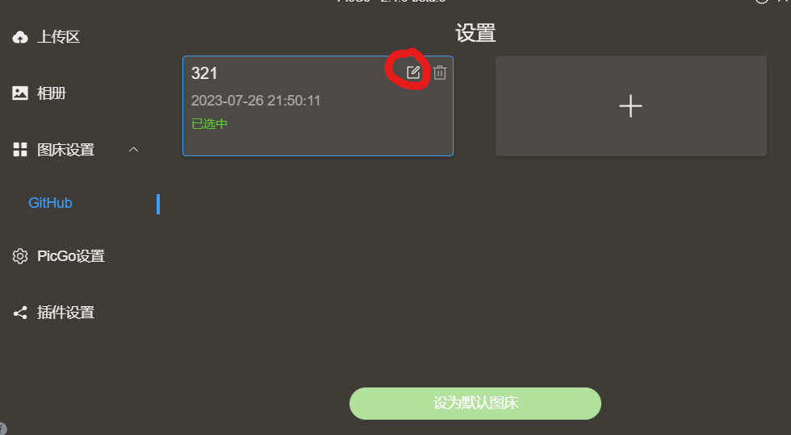
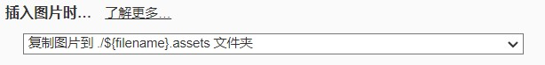
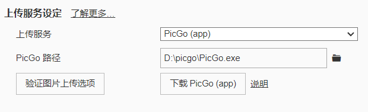

## 前期准备

> 创建一个GitHub仓库
>
> 下载了PicGo和Typora

## 获取Github的Token

> 首先打开Github**设置**
>
> 左侧最下面找到**开发者设置**
>
> 点击**个人访问令牌**，点击**Tokens（classic）**
>
> 点击**生成新令牌**，下面的**Generate new token(classic)**
>
> 输入自己的密码后，随意命名一个名字，勾选下面的**repo**
>
> 
>
> 建议有效期选择**无有效期**，否则过期后要重新回来设置
>
> 最后划到最下面，点击**生成令牌**
>
> 复制获得的token值

## PicGo配置

> 打开PicGo
>
> 点击**PicGo设置**
>
> 打开**时间戳设置**，把下面的请选择显示的图床，只勾选**Github**
>
> 在点击**图床设置**，点击此处
>
> 
>
> 图床配置名随意配置，仓库名填写 <Github名>/<仓库名>，分支名填仓库所在的分支（一般为main或master），token填写之前复制的token值，存储路径填 image/
>
> 
>
> 确认设置后，点击**设为默认图床**

## Typora配置

> 点击**文件**中的**偏好设置**，点击**图像**
>
> 在**插入图片时**选择**复制图片到./${filename}.assets文件夹**
>
> 
>
> 在到下方的**上传服务设定**里面设置
>
> 上传服务选择**PciGo（app）**
>
> PicGo路径选择下载的picgo文件里面的**PicGo.exe**
>
> 然后点击**验证图片上传选项**
>
> 
>
> 看到电脑右下角弹出**上传成功**后，即为成功

## 上传图片

> 写好文章后，右键图片，点击**上传图片**，即可上传到指定文件夹，最后在部署博客，即可成功，还可在自己的Github仓库查看自己上传的图片
>
> 
>
> 注意：每张图片都要记得上传，否则上传的博客会少图片
